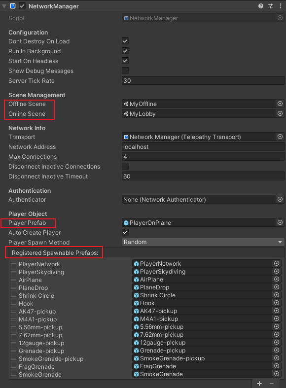
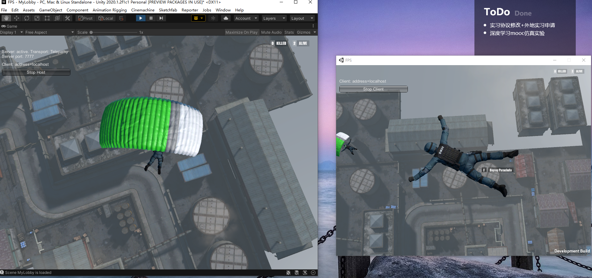

## 基于Unity的局域网联机FPS大逃杀游戏


### Mirror状态同步库

Mirror 是为 Unity 游戏构建多人游戏功能的系统。它建立在较低级别的传输实时通信层之上，并处理多人游戏所需的许多常见任务。传输层支持任何类型的网络拓扑，而Mirror是一个服务器权威系统，允许其中一个玩家同时是客户端和服务器，因此不需要专门的服务器进程，这使得开发人员只需很少的工作就可以通过互联网玩多人游戏。

Mirror 专注于易用性和迭代开发，并为多人游戏提供有用的功能，例如：

- 消息处理程序
- 通用高性能序列化
- 分布式对象管理
- 状态同步
- 网络类：服务器、客户端、连接等


**服务器和主机**

Mirror多人游戏包括：

- 服务器

服务器是游戏的一个实例，所有其他玩家想要一起玩时都可以连接到该实例。服务器通常管理游戏的各个方面，例如记分，并将该数据传输回客户端。

- 客户端

客户端是游戏的实例，通常从不同的计算机连接到服务器。客户端可以通过本地网络或在线连接。

服务器可能是“专用服务器”或“主机服务器”。

- 专用服务器

这是一个仅作为服务器运行的游戏实例。

- 主机服务器

当没有专用服务器时，其中一个客户端也扮演服务器的角色。这个客户端是“主机服务器”。主机服务器创建游戏的单个实例（称为主机），它既充当服务器又充当客户端。主机使用一种特殊的内部客户端进行本地客户端通信，而其他客户端是远程客户端。本地客户端通过直接函数调用和消息队列与服务器通信，因为它们在同一个进程中。它实际上与服务器共享场景。远程客户端通过常规网络连接与服务器通信。

**权限管理**

Network Authority是决定谁拥有对象并对其进行控制的一种方式。

- Server Authority

服务器权限意味着服务器可以控制一个对象。默认情况下，服务器对对象具有权限。这意味着服务器将管理和控制收藏品、移动平台、NPC 和任何其他不属于玩家的联网对象。

- Client Authority

客户端权限意味着客户端可以控制一个对象。

当客户端对某个对象拥有权限时，这意味着他们可以调用Command并且当客户端断开连接时，该对象将自动销毁。

即使客户端对对象拥有权限，服务器仍然控制 SyncVar 并控制其他序列化功能。组件需要使用Command来更新服务器上的状态，以便与其他客户端同步。

**网络连接中的ID**

ID用于标识prefab、场景、网络对象实例、客户端与服务器的连接。

- asset ID用于识别要让服务器生成何种prefab
- scene ID用于区分场景对象，因为不同场景的不同物体ID不唯一
- 网络对象实例ID在服务器生成其之后分配其一个ID，用于消息传递时判断接收对象
- 连接ID，给每个网络连接一个ID

**NetworkBehaviour（基类）**

NetworkBehaviour能处理具有 NetworkIdentity 组件的游戏对象。这些脚本可以执行高级 API 功能，例如 Commands、ClientRpc's、SyncEvents 和 SyncVars。

- 拥有各种属性判断联网对象的状态

- 内置网络回调函数，用于流程控制，例如：

```c#
public class Foo : NetworkBehaviour
{
    public override void OnStartServer()
    {
        // disable client stuff
    }

    public override void OnStartClient()
    {
        // register client events, enable effects
    }
}
```

- 使用各种定制特性

**定制特性（核心）**

Mirror使用一些定制特性在指定的函数上，使其能在客户端/服务器上运行。

**[Server]** 只有服务器可以调用该方法（在客户端调用时抛出警告或错误）。

**[ServerCallback]** 与**[Server]**相同，但在客户端调用时不抛出警告。

**[Client]** 只有客户端可以调用该方法（在服务器上调用时抛出警告或错误）。

**[ClientCallback]** 与**[Client]**相同，但在服务器上调用时不会发出警告。

**[ClientRpc]** 服务器使用远程过程调用 (RPC) 在客户端上运行该功能。

**[TargetRpc]** 与 ClientRpc 特性不同，这些函数是在一个单独的目标客户端上调用的。

**[Command]** 从客户端调用此函数以在服务器上运行此函数，但只有在方法的参数为可序列化时才能使用。

**[SyncVar]** 用于将变量（可序列化）从服务器自动同步到所有客户端。如果对象有network identity，可使用Hook执行函数。

**远程动作的实现**

网络系统可以通过网络执行操作。这些类型的操作有时称为远程过程调用。网络系统中有两种类型的RPC。

- Command 从客户端调用并在服务器上运行
- ClientRpc 在服务器上调用并在客户端上运行

传递给Command和 ClientRpc 调用的参数被序列化并通过网络发送。

下图显示了远程操作采取的方向：


**Command**

Command从客户端上的Player对象发送到服务器上的Player对象。为了安全起见，默认情况下只能从您的玩家对象发送命令，但也可以通过其他方式绕过权限。

要将函数变成命令，请向其添加 [Command] 定制特性，并可选择添加“Cmd”前缀以进行命名约定。该函数现在将在客户端调用时在服务器上运行。

**ClientRpc**

ClientRpc 调用从服务器上的对象发送到客户端上的对象。它们可以从具有已生成的 NetworkIdentity 的任何服务器对象发送。由于服务器具有权限，因此服务器对象能够发送这些调用不存在安全问题。要使函数成为 ClientRpc 调用，请向其添加 [ClientRpc] 自定义属性，并可选择添加“Rpc”前缀以进行命名约定。此函数现在将在服务器上调用时在客户端上运行。

**TargetRpc**

TargetRpc 函数由服务器上的用户代码调用，然后在指定的客户端上的相应客户端对象上调用。RPC 调用的参数在网络上进行序列化，以便使用与服务器上的函数相同的值调用客户端函数。这些函数应以命名约定的前缀“Target”开头，并且不能是静态的。

**状态同步**

状态同步指的是属于脚本的整数、浮点数、字符串和布尔值等值的同步。

状态同步是从服务器到远程客户端完成的。本地客户端没有序列化的数据。它不需要它，因为它与服务器共享场景。

数据不以相反的方向同步——从远程客户端到服务器。为此，需要使用命令。

- SyncVars

SyncVars是继承自 NetworkBehaviour 的类的特性，它们从服务器同步到客户端。当一个游戏对象被生成，或者一个新玩家加入正在进行的游戏时，他们会收到他们可见的网络对象上所有 SyncVars 的最新状态。使用自定义特定指定要同步的脚本中的哪些变量。当 SyncVar 的值更改时，服务器会自动发送 SyncVar 更新。

- SyncVar Hooks

hook 特性可用于指定当 SyncVar 在客户端更改值时要调用的函数。

**消息发送机制**

发送的每条消息都将被批处理，直到帧结束，以最大限度地减少带宽和传输调用。例如，如果您发送大量 10 字节的消息，那么我们通常可以将大约 120 条消息放入一个大约 1200 字节的**MTU**大小的批次中。

对于传输层，以 1200 字节的块发送消息非常方便。大于**MTU**消息将作为单个批次发送。确切地说，传输层决定了 Mirror 的目标批次大小。

Mirror批处理是双向的。这意味着客户端和服务器都会批处理它们的消息并在帧结束时将它们清除。

简而言之，批处理显着降低了带宽并提高了性能。

**游戏对象的不同同步处理**

Networked **GameObjects**是由 Mirror 的网络系统控制和同步的游戏对象。

Mirror 中的多人游戏通常使用包含联网游戏对象和非联网游戏对象的场景构建。

联网游戏对象是在游戏过程中以需要在所有一起玩游戏的用户之间同步的方式移动或改变的对象。

非联网游戏对象是那些在游戏过程中不移动或根本不改变的对象。

联网游戏对象是一个附加了网络标识组件的游戏对象。然而，仅一个网络标识组件不足以让您的游戏对象在您的多人游戏中发挥作用并处于活动状态。Network Identity 组件是同步的起点，它允许网络管理器同步游戏对象的创建和销毁，但除此之外，它没有指定应该同步游戏对象的哪些属性。

每个联网游戏对象上究竟应该同步什么取决于您正在制作的游戏类型，以及每个游戏对象的目的是什么。可能想要同步的一些示例是：

- 移动游戏对象的Transform
- 动画游戏对象的动画状态
- 变量的值，例如当前一轮游戏还剩多少时间，或者玩家有多少能量。

其中一些东西可以通过 Mirror 自动同步。联网游戏对象的同步创建和销毁由 NetworkManager 管理，称为 Spawning。您可以使用 Network Transform 组件来同步游戏对象的位置和旋转，您可以使用 Network Animator 组件来同步游戏对象的动画。

### 游戏网络同步实现

**网络管理对象**

指定离线、在线场景，Player Prefab以生成玩家对象，及所有需要在服务器上生成（包含静态和动态）的对象，都需要在网络管理对象中注册才可以生成，由服务器同步。



**主机创建**


作为主机创建时点击Host作为主机运行，点击Client可搜索localhost的服务器并进行连接。

**乘空阶段**


当加入游戏后，场景由MyOffline变为MyLobby，玩家对象将由**NetworkManager**自动为每个网络连接创建分配，其中一开始生成的是**PlayerOnPlane**玩家对象，其仅仅持有的是Network Identity，无任何其他脚本。按下F可从机舱弹出。

其中，玩家操作由**PlaneDropManager**管理。

飞机生成与同步如下：

```c#
public class PlaneDropManager : NetworkBehaviour
{
	public override void OnStartServer()
	{
		base.OnStartServer();
		//在服务器上生成飞机，设置航行路线
		SetupFlightPath();
	}

    public override void OnStartClient()
	{
		base.OnStartClient();
        //服务器为每个客户端生成了airplane对象，只需在客户端指定即可
		airplane = FindObjectOfType<PlaneManager>().gameObject;
	}

    [Server]
	private void SetupFlightPath()
	{
        //确定飞机的起点终点速度
		//...
		SpawnPlane();
	}

    [Server]
	void SpawnPlane()
	{
        //生成飞机对象
		planeStart.transform.LookAt (right[endFlightIndex]);
		airplane = Instantiate(planeSpawn, planeStart.transform.position, planeStart.transform.rotation);
		airplane.GetComponent<PlaneManager>().airspeed = planeAirspeed;
        //在服务器上生成
		NetworkServer.Spawn(airplane);
	}
}
```

玩家跳伞如下，由于PlaneManager不属于客户端，因此没有权限发送Command给服务器，使其执行替换Player操作

但是可以通过指定参数ignoreAuthority = true绕过权限判断，从而发出Command

```c#
[Client]
void PlayerJump()
{
    //确定玩家从仓库弹出时的状态
    //...

    //替换当前连接的Player对象
    CmdReplacePlayer(jumpPosition, new Vector3(dir.x, 0, dir.z), ClientScene.localPlayer.connectionToClient);
}

[Command(ignoreAuthority = true)]
void CmdReplacePlayer(Vector3 position, Vector3 forward, NetworkConnectionToClient conn = null)
{
    // Cache a reference to the current player object
    GameObject oldPlayer = conn.identity.gameObject;
    // Instantiate the new player object and broadcast to clients
    GameObject player = Instantiate(GlobalLibrary.instance.skyDivingPlayerPrefab);
    player.transform.position = position;
    player.transform.forward = forward;
    NetworkServer.ReplacePlayerForConnection(conn, player);

    // Remove the previous player object that's now been replaced
    NetworkServer.Destroy(oldPlayer);
}
```

**跳伞阶段**

PlayerOnPlane被替换为了PlayerSkyDiving

- NetworkIdentity标识这是一个联网对象
- NetworkTransform将其Transform同步
- NetworkRigidbody用于Rigidbody的同步
- NetworkAnimator用于人物动画的同步


其中类SkydivingController有网络行为，其更新逻辑只需在**本地**执行，通过NetworkTransofrm、NetworkRigidbody、NetworkAnimator

将其同步即可。需要使用网络行为的函数只有CmdReplacePlayer(NetworkConnectionToClient)，逻辑同上，将其替换为落地后的Player。




**道具生成**


首先将所有需要服务器同步的道具在NetworkManager中进行注册，后利用NetworkServer.Spawn()进行对象在服务器的生成即可，服务器会在所有已连接的客户端上生成相同的对象，并同步状态。

```c#
public class NetworkSpawner : NetworkBehaviour
{

    #region Singleton

    public static NetworkSpawner instance;

    private void Awake()
    {
        instance = this;
    }

    #endregion


    public NetworkIdentity[] prefabsToSpawn;

    private int count = -2;
    public override void OnStartServer()
    {
        for (int j = 0; j < 2; j++)
        {
            for (int i = 0; i < prefabsToSpawn.Length; i++)
            {
                //实例化对象
                GameObject instance = Instantiate(prefabsToSpawn[i].gameObject, gameObject.transform);
                instance.transform.localPosition = new Vector3(count++ * 2, .5f, 0);
                instance.transform.localRotation = Quaternion.identity;
                //服务器生成并同步
                NetworkServer.Spawn(instance);
            }
        }
    }
}
```

**道具拾取**


道具拾取的逻辑如下，**在拾取的客户端发出命令，使其在服务器上销毁对象，同步到客户端，而客户端的行为则是只需要将其添加到仓库即可，而仓库不需要进行玩家之间的同步**。

当不希望其他玩家看到某些玩家数据时，通常会出现这种情况。在inspector中，将“网络同步模式”从“观察者”（默认）更改为“所有者”，让 Mirror 知道只与拥有的客户端同步数据。

例如，正在制作一个仓库系统。假设玩家 A、B 和 C 在同一区域。整个网络总共会有12个对象：

- 客户端 A 有玩家 A（他自己）、玩家 B 和玩家 C
- 客户端 B 有玩家 A 、玩家 B（他自己）和玩家 C
- 客户端 C 有玩家 A 、玩家 B 和玩家 C（他自己）
- 服务器有玩家 A、玩家 B、玩家 C

他们每个人都会有一个库存组件

假设玩家 A 捡到了一些战利品。服务器将战利品添加到玩家 A 的库存中，该库存将具有SyncList of Items。

默认情况下，Mirror 现在必须在所有地方同步玩家 A 的库存，这意味着向客户端 A、客户端 B 和客户端 C 发送更新消息，因为它们都有玩家 A 的副本。这很浪费，客户端 B 和客户端 C 没有需要了解玩家 A 的库存，他们从未在屏幕上看到它。这也是一个安全问题，有人可以破解客户端并显示其他人的库存并利用它来获取优势。

如果在库存组件中将“网络同步模式”设置为“所有者”，则玩家 A 的库存将仅与客户端 A 同步。

现在，假设一个区域有 50 个人而不是 3 个人，并且其中一个人捡起战利品。这意味着您不会向 50 个不同的客户端发送 50 条消息，而是只发送 1 条。这会对您的游戏带宽产生重大影响。

```c#
//ItemManager.cs
private void Update()
{
    if (!isInRange)
        return;
    itemWUI.LookAtCamera();
    if (Input.GetKeyDown(pickUpButtonTextLowerCase) && canPickup)
    {
        CmdPlayDissolveEffect();
        onPickup.Invoke();
        CmdDestroyLater();
        canPickup = false;
    }
}

[Command(ignoreAuthority = true)]
public void CmdDestroyLater()
{
    Invoke(nameof(DestroySelf), 2f);
}

[Server]
void DestroySelf()
{
    NetworkServer.Destroy(gameObject);
}
```

**道具丢弃**

由丢弃者的客户端发出命令，使其在服务器上生成物品。

```c#
//NetworkSpawner.cs
[Command(ignoreAuthority = true)]
public void CmdSpawnItemPickup(string itemName, int itemAmount, Vector3 position, Quaternion rotation)
{
    GameObject pickup = Instantiate(ItemAssets.instance.GetPickupPrefab(itemName), gameObject.transform);
    //设置pickup属性
    //...
    NetworkServer.Spawn(pickup);
}
```

**子弹射击**


子弹的轨迹同步在这里很有trick，子弹是由射击者发出Command使服务器发送消息，利用ClientRpc告诉所有客户端生成同样信息的子弹，而子弹的飞行模拟只需在客户端上自行模拟即可，不需要进行同步，造成子弹同步的假象。

其中，子弹及其轨迹、击中效果均采用了对象池模式。

```c#
using System.Collections.Generic;
using Mirror;
using UnityEngine;

public class BulletPool : NetworkBehaviour
{
    public static BulletPool instance;

    [Header("Bullet Pool infos")]
    public int amount = 30;
    public bool shouldExpand = true;
    private readonly List<Bullet> bulletPool = new List<Bullet>();
    private readonly List<Bullet> bullets = new List<Bullet>();

    public float maxLifeTime = 2f;

    private Ray ray;
    private RaycastHit hit;


    private void Awake()
    {
        instance = this;
        for (int i = 0; i < amount; i++)
        {
            bulletPool.Add(new Bullet());
        }
    }

    private void Update()
    {
        if (bullets.Count > 0)
        {
            UpdateBullets(Time.deltaTime);
        }
    }

    [Command(ignoreAuthority = true)]
    public void CmdSpawnBullet(Vector3 position, Vector3 velocity, float bulletDropSpeed, string bulletTrailPrefabName, string owner, string weaponName)
    {
        RpcSpawnBullet(position, velocity, bulletDropSpeed, bulletTrailPrefabName, owner, weaponName);
    }

    [ClientRpc]
    private void RpcSpawnBullet(Vector3 position, Vector3 velocity, float bulletDropSpeed, string bulletTrailPrefabName, string owner, string weaponName)
    {
        SpawnBullet(position, velocity, bulletDropSpeed, bulletTrailPrefabName, owner, weaponName);
    }


    public void SpawnBullet(Vector3 position, Vector3 velocity, float bulletDropSpeed, string bulletTrailPrefabName, string owner, string weaponName)
    {
        for (int i = 0; i < bulletPool.Count; i++)
        {
            if (bulletPool[i].time >= maxLifeTime)
            {
                var bullet = bulletPool[i];
                bullet.initPosition = position;
                bullet.initVelocity = velocity;
                bullet.dropSpeed = bulletDropSpeed;
                bullet.time = 0f;
                bullet.tracer = Instantiate(GetTrailPrefab(bulletTrailPrefabName), position, Quaternion.identity);
                bullet.tracer.AddPosition(position);
                bullet.owner = owner;
                bullet.weaponName = weaponName;
                bullets.Add(bullet);
                return;
            }
        }

        if (shouldExpand)
        {
            var bullet = new Bullet
            {
                initPosition = position,
                initVelocity = velocity,
                dropSpeed = bulletDropSpeed,
                time = 0f,
                tracer = Instantiate(GetTrailPrefab(bulletTrailPrefabName), position, Quaternion.identity),
            };
            bullet.owner = owner;
            bullet.weaponName = weaponName;
            bullet.tracer.AddPosition(position);
            bulletPool.Add(bullet);
            bullets.Add(bullet);
            Debug.Log("扩容 ：" + bulletPool.Count);
        }
    }

    public void UpdateBullets(float deltaTime)
    {
        //更新所有子弹的位置
        bullets.ForEach(bullet =>
        {
            Vector3 p0 = GetPosition(bullet);
            bullet.time += deltaTime;
            Vector3 p1 = GetPosition(bullet);
            RaycastSegment(p0, p1, bullet);
        });
        //将超过生命周期的子弹清除
        bullets.RemoveAll(bullet => bullet.time >= maxLifeTime);
    }

    Vector3 GetPosition(Bullet bullet)
    {
        // p + v*t + 0.5*g*t*t
        Vector3 gravity = Vector3.down * bullet.dropSpeed;
        return (bullet.initPosition) + (bullet.initVelocity * bullet.time) + (0.5f * gravity * bullet.time * bullet.time);
    }

    void RaycastSegment(Vector3 start, Vector3 end, Bullet bullet)
    {
        Vector3 direction = end - start;
        ray.origin = start;
        ray.direction = direction;
        if (Physics.Raycast(ray, out hit, direction.magnitude))
        {
            //Get hit object's type, deciding which hit effect to use
            var hitObjectType = hit.transform.tag;
            //Play Hit Effect
            ShowHitEffect(hit, GetHitEffectName(hitObjectType));
            if (hitObjectType == "Player")
            {
                hit.collider.GetComponent<Player>()?.TakeDamage(10f, bullet.owner, bullet.weaponName);
            }

            //更新trail
            bullet.tracer.transform.position = hit.point;
            //击中了，则子弹生命周期结束
            bullet.time = maxLifeTime;
        }
        else
        {
            bullet.tracer.transform.position = end;
        }
    }

}
```

**血量同步**


由于Player是有服务器权限的，因此使用SyncVar特性标记的变量会自动同步信息到所有客户端。

```c#
public class Player : NetworkBehaviour
{
    [SyncVar]
    public float hp = 100;
}
```


**击杀提示**


在击杀玩家后，击杀者和被击杀者的屏幕下方均出现击杀信息，而其他客户端只有右上角的击杀提示。

因此需要针对目标客户端进行消息发送，服务器同步玩家血量信息，当玩家收到伤害时进行死亡判定，如果死亡则TargetRpc向目标客户端发送消息，向所有客户端广播消息

```c#
//Player.cs
[Server]
public void TakeDamage(float damage, string damageMaker, string weaponName)
{
    hp -= damage - defensePower;
    if (hp <= 0)
    {
        //...
        //向所有玩家显示死亡信息
        RpcShowKillInfo(damageMaker, weaponName, gameObject.name);
        //向击杀者显示具体击杀信息
        TargetUpdateKiller(killer, weaponName, gameObject.name, aliveNumberCurrent);
        //向被击杀者显示具体死亡信息
        TargetUpdateKilled(damageMaker, weaponName, aliveNumberBefore);
        //让所有玩家客户端上销毁此对象
        RpcOnPlayerDead();
        //在被击杀者者客户端上执行死亡UI展示
        TargetOnPlayerDead();
    }
}


[TargetRpc]
void TargetUpdateKiller(NetworkConnection target, string weaponName, string killed, int aliveNumber)
{
    Debug.Log($"我是killer, 我的名字是{target.identity.gameObject.name}");
    var uiManager = UIManager.instance;
    //Set kill detail in screen center
    var curKillNumber = int.Parse(UIManager.instance.killNumber.text);
    curKillNumber++;
    uiManager.killNumber.text = curKillNumber.ToString();
    var startIndex = weaponName.IndexOf("(", StringComparison.Ordinal);
    if (startIndex >= 0)
        weaponName = weaponName.Remove(startIndex);
    uiManager.killDetail.text = "You Killed " + killed + " by " + weaponName;
    uiManager.killCount.text = curKillNumber + " kills";
    Debug.Log($"当前剩余人数为{GameManager.instance.aliveNumber}");
    //Test if game end
    if (aliveNumber == 1)
    {
        ShowGameEndingScreen(target.identity.gameObject, "killer", aliveNumber);
    }
    else
    {
        uiManager.animator.enabled = true;
        uiManager.animator.SetTrigger("KillEvent");
    }
}

[TargetRpc]
void TargetUpdateKilled(string killer, string weaponName, int aliveNumber)
{
    Debug.Log($"我是被杀的, 我的名字是{gameObject.name}");
    var uiManager = UIManager.instance;
    //Set kill detail in screen center
    if (!string.IsNullOrEmpty(killer))
    {
        var startIndex = weaponName.IndexOf("(", StringComparison.Ordinal);
        if (startIndex >= 0)
            weaponName = weaponName.Remove(startIndex);
        uiManager.killDetail.text = $"You were Killed by {killer} with {weaponName}";
    }
    else
    {
        uiManager.killDetail.text = "You died outside play zone";
    }
    uiManager.killCount.text = "";

    //Show game ending screen
    ShowGameEndingScreen(gameObject, "killed", aliveNumber);
}

[ClientRpc]
void RpcOnPlayerDead()
{
    DisablePlayer();
}

[ClientRpc]
void RpcShowKillInfo(string damageMaker, string weaponName, string killed)
{
    UIManager.instance.killHint.GetComponent<KillStatsBoard>().ShowKillHint(damageMaker, weaponName, killed);
}
```

## 基于ECS的web端海空兵棋推演系统


**Archetype实例**

```Go
type Aircraft struct {
    Position         component.PositionData
    Velocity         component.VelocityData
    Heading          component.HeadingData
    Destination      component.DestinationData
    ForceDestination component.DestinationData
    HealthPoint      component.HealthPointData
    Distance         component.DistanceData
    Death            component.DeathData
    Attribute        component.AttributeData
    Loadout          component.LoadoutData
    Signature        component.SignatureData
}
```

**Component示例**

```go
package component

import "github.com/yohamta/donburi"

// velocity in km/h
type VelocityData struct {
    // linear velocity, in km/h
    Linear float64
    // angular velocity, in degree/s
    Angular Angle
    // maximum linear velocity, in km/h
    LinearMaximum float64
    // maximum angular velocity, in degree/s
    AngularMaximum Angle
}

var Velocity = donburi.NewComponentType[VelocityData]()
```

**System示例**

```go
type PowerSystem struct {
    query *query.Query
    time  *ecs.Time
}


func (ps *PowerSystem) Update(w *donburi.World) {
	ps.query.Each(*w, func(e *donburi.Entry) {
		if util.CheckDeath(e) {
			return
		}
		velocity := component.Velocity.Get(e)
		distance := component.Distance.Get(e)
		exdistance := velocity.Linear * ps.time.HourElapsed()
		distance.Value += exdistance
	})
}
```

**Event Mechanism示例**

```go
//event.go
type Strike struct {
    Entry       *donburi.Entry `json:"-"`
    Missile     string         `json:"Missile" binding:"required"`
    Target      uuid.UUID      `json:"Target" binding:"required"`
    Escape      bool           `json:"Escape"`
    TargetEntry *donburi.Entry `json:"-"`
}

var StrikeEvent = events.NewEventType[Strike]()

func (s *Strike) Execute(world donburi.World, entry *donburi.Entry, uuid2EntryMap *util.UUID2Entry) error {
	//...
    if ableToStrike {
        StrikeEvent.Publish(world, *s)
    } else {
        return fmt.Errorf("无法侦测到 %v (%v) ，无法打击", targetAttribute.Name, targetAttribute.ID)
    }
    return nil
}

//event_system.go
func NewEventSystem(w *donburi.World, config pkg.Config) *EventSystem {
	//...
	event.StrikeEvent.Subscribe(*w, strike)
	return &EventSystem{}
}


func (e *EventSystem) Update(w *donburi.World) {
	events.ProcessAllEvents(*w)
}

func strike(w donburi.World, event event.Strike) {
	archetype.SpawnMissile(w, event.Missile, event.Entry, event.TargetEntry)
}

//env_route.go
func AddEnvRoutes(rg *gin.RouterGroup) {
	env := rg.Group("/envs")
	env.Use(handler.ErrorHandlingMiddleware())
	//...
	env.POST("/:id/step", handler.ValidateIDMiddleware(), handler.EnvHandlerStep)
}

//env_handler.go
func EnvHandlerStep(ctx *gin.Context) {
	commands := make(map[string]game.Command)
	if err := ctx.BindJSON(&commands); err != nil {
		//...
	}
    if err = game.Tick(&commands); err != nil {
		//...
	}
    //...
}

//game.go
type Command struct {
    //...
	Strike       *event.Strike       `json:"Strike"`
}

func (g *Game) Tick(commands *Commands) error {
	g.rwMutex.Lock()
	defer g.rwMutex.Unlock()
	//...
	for uidStr, command := range *commands {
		// ...
		actions := []CommandAction{}
		if command.Strike != nil {
			actions = append(actions, command.Strike)
		}
		for _, action := range actions {
			err := action.Execute(*g.GetWorld(), entry, uuid2EntryMap)
			if err != nil {
				return err
			}
		}
	}
	for i := 0; i < g.time.Gap; i++ {
		g.schduler.Update()
		g.time.Next()
		g.wind.Tick(g.time.Tick)
	}
	return nil
}
```

## 基于轻量级引擎HGE的超级玛丽复刻


定点数

```c++
#include <cstdint>
#include <iostream>

class Fixed {
public:
    int32_t value;
    static constexpr int SHIFT = 16;

    Fixed() : value(0) {}
    Fixed(int v) : value(v << SHIFT) {} // Convert int to fixed
    Fixed(float v) : value(static_cast<int32_t>(v * (1 << SHIFT))) {} // Convert float to fixed

    Fixed operator+(Fixed other) const { return Fixed::fromRaw(value + other.value); }
    Fixed operator-(Fixed other) const { return Fixed::fromRaw(value - other.value); }
    Fixed operator*(Fixed other) const { return Fixed::fromRaw((int64_t)value * other.value >> SHIFT); }
    Fixed operator/(Fixed other) const { return Fixed::fromRaw((int64_t)value << SHIFT / other.value); }

    float toFloat() const { return (float)value / (1 << SHIFT); }
    int toInt() const { return value >> SHIFT; }

    static Fixed fromRaw(int32_t raw) { Fixed f; f.value = raw; return f; }

    friend std::ostream& operator<<(std::ostream& os, const Fixed& f) {
        os << f.toFloat();
        return os;
    }
};
```

游戏循环

```c++
Fixed fixedDeltaTime = Fixed(1) / Fixed(60);  // 60Hz 更新
Fixed accumulatedTime = 0;
Fixed alpha = 0;

void Game::Update(Fixed dt)
{
    // 先进行FixedUpdate
    accumulatedTime += deltaTime;
    while (accumulatedTime >= fixedDeltaTime) {
        world->FixedUpdate(fixedDeltaTime);
        accumulatedTime -= fixedDeltaTime;
    }
    // 用于动态插值渲染
    alpha = accumulatedTime / fixedDeltaTime;

	world->Update(dt);
}


void World::Update(Fixed dt)
{
	actor->HandleInput();
	actor->Update(dt);
	monsterSpawner->Update(dt);
	for(int i=0;i<MAX_ENTITY;i++)
		if(entity[i]!=NULL)
			entity[i]->Update(dt);
	//...
	TriggerManager::GetInstance().Update(dt);
    camera->Update(dt);
}

void World::Render(Fixed alpha)
{
	//背景层渲染
	map->RenderBackground(*camera, alpha);
	//交互层渲染
	for(int i=0;i<MAP_WIDTH/16;i++)
			for(int j=0;j<MAP_HEIGHT/16;j++)
				if(tile[i][j]) tile[i][j]->Render(*(camera->GetCamera(3)), alpha);
	for(int i=0;i<MAX_ENTITY;i++)
		if(entity[i]!=NULL)
			entity[i]->Render(*(camera->GetCamera(3)), alpha);
	actor->Render(*(camera->GetCamera(3)), alpha);
	//前景层渲染
	map->RenderForeground(*camera, alpha);
}
```

状态模式 & 组件模式

```c++
class GameEntity
{
	public:
		GameEntity(){}
		virtual ~GameEntity();
		//********************************************************//
		void InitConfig(hgeVector pos);
		void* GetComponent(TYPE_COMPONENT);
		virtual void FixedUpdate();
		virtual void Update(float dt);
		void Render(Camera&);

		virtual void TakeBump(){}

		hgeVector pos;
		hgeVector v;

		State* curState;
		OnInitState* onInitState;
		OnDestroyState* onDestroyState;
		OnSpawnState* onSpawnState;
		OnUpdateState* onUpdateState;

		virtual void OnInit(PhysicsComponent*, GraphicsComponent*){}
		virtual void OnSpawn(hgeVector birthplace){}
		virtual void OnUpdate(){}
		virtual void OnDestroy(){}

	protected:
		PhysicsComponent* physics;
		GraphicsComponent* graphics;
};

class Actor:public GameEntity
{
	public:
		Actor(InputComponent*, PhysicsComponent*, GraphicsComponent*, hgeVector birthplace);
		virtual ~Actor();
		void HandleInput();
		virtual void Update(float dt);

		virtual void OnInit(PhysicsComponent*, GraphicsComponent*);
		virtual void OnSpawn(hgeVector birthplace);
		virtual void OnUpdate();
		virtual void OnDestroy();

		StandState* stand;//站在地面
		StandState* aloft;//在空中
		StandState* run;//奔跑状态
		BounceState* jump[3];
		int imageDirection;
	protected:
		InputComponent* input;
		float kButtonLastedTime;
		int order[3];//MOVE_RIGHT, MOVE_LEFT, JUMP
};
```


