> Do not communicate by sharing memory. Instead, share memory by communicating.

## 前言

学习计算机这么多年来，因为各种课程作业+课题项目，接触到形形色色的语言。

C，C++，C#，Java，JavaScript，TypeScript，Lua，Python，Go……

以下是我对这些语言**曾经的**内心写照：

- **C**不就是那种老派的、直接操控硬件和内存、写系统程序的**效率王者**嘛？
- **C++** 就在C的基础上搞了个**面向对象编程**，加了些**模板**啥的。
- **Java**不就是那个写一次到处跑，**不用操心内存管理**，企业里搞大项目的利器嘛？
- **C#** 呢，就是**微软家的Java**，搞了个.NET框架，不用手动管内存，还能写Windows应用和游戏。
- **JavaScript**就是**前端之王，动态类型**，搞网页交互特别溜，还能用Node.js搞后端。
- **TypeScript**不就是给JavaScript加了**类型检查**，更适合大型项目，让代码更靠谱嘛。
- **Lua**呢，就是**轻量级**的脚本语言，特别好嵌到C程序里，做游戏**热更新**啥的特别方便。
- **Python**不就是那个**语法简单、上手快、啥都能干**，从数据分析到Web开发，哪都能看到它的影子。
- **Go**嘛，就是Google出品的**简洁高效版C，专注并发编程**，服务器端开发超级牛。

从一种语言迁徙到另一种语言，感受无非就是xxx更方便了，yyy不太行。只不过是把编程习惯照搬过去罢了，只是表面不同的问题，有什么区别吗？

然而，在我看了Peter Norvig的 [Teach Yourself Programming in Ten Years](https://norvig.com/21-days.html) 一文后，
被啪啪打脸，自己的理解还是太浅显了。

> A language that doesn't affect the way you think about programming, is not worth knowing. ——Alan Perlis

> One possible point is that you have to learn a tiny bit of C++ (or more likely, something like JavaScript or Processing) because you need to interface with an existing tool to accomplish a specific task. But then **you're not learning how to program**; you're **learning to accomplish that task**.

没错，过往日子的多数时候，我只是在学习怎么用一门语言去完成一项特定的任务罢了，不断地repeat，并没有去汲取这门语言给我带来的编程思维上的提升。

就像玩英雄联盟一样

- 上单教会我极致细节的个人对线能力、兵线处理、中后期的边线处理
- 打野教会我发育和Gank之间的平衡，中立资源的控制，眼观六路耳听八方观察敌我全局
- 中单教会我游走的时机，与打野的联动
- AD教会我团战中的极致拉扯与自我保护
- 辅助教会我视野控制与开团保护
- 不同定位的英雄，法师教你发育后期发力，刺客教你游走与团战绕后切C，软辅教你保护与对线压力，硬辅教你抓timing开团……

当我集齐所有板块，补上短板，水平段位自然晋升飞快。

学习不同编程语言，是为了汲取其语言设计上的精华，内化为自己编程思维的内功。

> Learn at least a half dozen programming languages.Include one that **emphasizes parallelism** (like Clojure or Go).

痛定思痛，拾起Go语言，一探究竟。

吸星大法启动，并发编程的思维，是我的了！

## 并发 or 并行?

[Concurrency is not Parallelism (go.dev)](https://go.dev/talks/2012/waza.slide#1)

**并发(Concurrency)**

指在同一时间段内，多种不同类型的任务或操作可以进行**交错执行**，不要求同时执行。关注点在宏观上的任务调度，单处理器单线程也可以做到并发。
核心思想是通过将一个大任务拆分为多种**独立的**子任务，而这些子任务能不能利用多处理器去并行处理，是隐藏的细节不必关心。

操作系统中的进程调度就是并发，多个应用程序（如浏览器、音乐播放器、键盘鼠标输入）同时运行，每个应用程序被操作系统分配时间片轮流执行。即使只有一个CPU核心，但通过快速切换任务，让用户感觉多个程序在同时运行。

**并行(Parallelism)**

指在同一时刻，多个相同类型的任务同时执行，需要多核处理器。

如向量的点乘，矩阵乘法等，同一种类型的任务，利用多核去并行计算。

## 并发编程模型

### 线程（Threads）

最常见的并发模型，多个线程在同一个进程内并发执行。线程之间共享内存，但需要同步机制（如锁）来避免资源冲突。

以计数器为例，只用单线程只管往上加到n就完事了；而多线程每个线程累加1/n，等待所有线程做完再返回结果n（这个做法有点蠢但只是为了举例），为了避免数据冲突需要用互斥锁，最终开销反比单线程要大得多。

```go
func singleThreadCounter(n int) int {
	counter := 0
	for i := 0; i < n; i++ {
		counter++
	}
	return counter
}

func multiThreadCounter(n int, numGoroutines int) int {
	var counter int
	var mutex sync.Mutex
	var wg sync.WaitGroup

	incrementCounter := func() {
		defer wg.Done()
		for i := 0; i < n/numGoroutines; i++ {
			mutex.Lock()
			counter++
			mutex.Unlock()
		}
	}

	wg.Add(numGoroutines)
	for i := 0; i < numGoroutines; i++ {
		go incrementCounter()
	}
	wg.Wait()
	return counter
}
```

使用**Benchmark Testing**对两种做法进行性能分析，Profile with 'CPU Profiler'。

```go
import "testing"

const n = 1000000

func BenchmarkSingleThreadCounter(b *testing.B) {
	for i := 0; i < b.N; i++ {
		singleThreadCounter(n)
	}
}

func BenchmarkMultiThreadMutexCounter(b *testing.B) {
	const numGoroutines = 10
	for i := 0; i < b.N; i++ {
		multiThreadCounter(n, numGoroutines)
	}
}
```

结果如下

```go
goos: windows
goarch: amd64
cpu: 13th Gen Intel(R) Core(TM) i5-13400F
BenchmarkSingleThreadCounter
BenchmarkSingleThreadCounter-16    	    5262	    225,636 ns/op
BenchmarkMultiThreadCounter
BenchmarkMultiThreadCounter-16     	      22	  50,967,586 ns/op
```

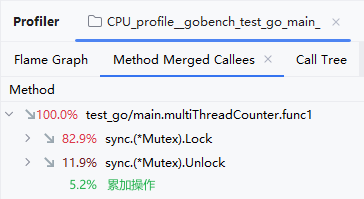
单线程计数器的平均耗时为225,636纳秒（约0.225毫秒）。

多线程计数器的平均耗时为50,967,586纳秒（约50.967毫秒）。

由于多线程需要同步共享资源，因此有锁争用和线程切换的开销，导致时间开销远远高于单线程。

### C#协程（Coroutines）

更轻量级的并发模型，可以在单线程内实现并发。协程通过yield和resume的方式交替执行，避免了线程的上下文切换开销。

在C#中，协程主要用于异步编程。协程函数返回`IEnumerator`，并且可以使用`yield return`来暂停执行。每次调用`MoveNext()`，协程都会从上次暂停的地方继续执行，直到所有`yield return`语句都执行完毕。简单来说，协程让你可以在同一个线程内实现异步操作，而不用担心复杂的线程管理。

**Unity中的协程调度**

在Unity中，协程的调度由Unity引擎管理。每帧Unity都会检查是否有活跃的协程。如果某个协程达到了继续执行的条件，Unity会调用该协程的`MoveNext()`方法，从上次`yield return`的地方继续执行。这种机制允许在游戏循环中实现复杂的异步行为而不阻塞主线程。

这样，你可以让一些耗时的任务分布在多帧中进行，而不会卡住游戏的主线程。

**非并行**

需要注意的是，C#中的协程并不能实现真正的并行执行。C#运行时不会像Go运行时那样将协程分配到不同的线程上执行。因此，C#协程主要用于非阻塞异步操作，不能代替线程和任务来实现并行计算。

这意味着C#的协程本质上只是用于Unity中的非阻塞异步操作的工具。如果你需要真正的并行执行，仍然需要使用线程（Thread）和任务（Task）。

**并发性**

尽管如此，C#的协程可以实现并发调度。例如，使用`StartCoroutine()`启动多个协程，每个协程可以独立执行各自的任务，并在异步操作结束时继续执行。这种并发性使得在处理多个独立任务时非常方便，比如同时处理多个动画、多个网络请求等。

让我们来看一个实际的游戏场景，如何使用协程在FPS游戏中实现一种三连发的枪。鼠标点击一次就能发射三颗子弹，但每颗子弹之间有细小的时间间隔。假设我们已经有一个单发子弹的函数`FireSingleBullet`。

**示例代码：实现三连发枪**

```csharp
using System.Collections;
using UnityEngine;

public class ThreeRoundBurstGun : MonoBehaviour
{
    // 定义子弹之间的时间间隔（例如0.1秒）
    public float bulletInterval = 0.1f;

    // 引用单发子弹发射函数
    private void FireSingleBullet()
    {
        // 这个函数假设已经实现，会发射一颗子弹
        Debug.Log("Bullet Fired");
    }

    // 调用三连发函数
    public void FireBurst()
    {
        StartCoroutine(FireBurstCoroutine());
    }

    // 协程实现三连发
    private IEnumerator FireBurstCoroutine()
    {
        for (int i = 0; i < 3; i++)
        {
            FireSingleBullet();
            yield return new WaitForSeconds(bulletInterval);
        }
    }

    // 示例：检测鼠标点击来触发三连发
    void Update()
    {
        if (Input.GetMouseButtonDown(0))
        {
            FireBurst();
        }
    }
}
```

### JS事件驱动模型（Event-driven model）

通过事件循环处理并发任务，如JavaScript的异步编程。

JavaScript 是一种单线程语言，这意味着它同一时刻只能执行一个任务。然而，通过异步编程和事件循环机制，JavaScript 可以高效地处理多个任务。

**宏任务和微任务**

- **宏任务**：比如 `setTimeout`，在指定的时间到达后，任务会被添加到宏任务队列。
- **微任务**：比如 `Promise`，在 `then` 或 `catch` 回调完成后，任务会被添加到微任务队列。
- **宏任务队列**：存放一些较大的任务，比如 `setTimeout`，整体脚本`script`也属于宏任务。
- **微任务队列**：存放一些较小的任务，比如 `Promise` 和 `async function`。微任务在每个宏任务执行完后立即执行。

**事件循环的工作原理**

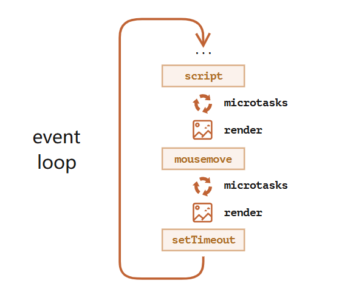

1. **执行宏任务**：事件循环从宏任务队列中取出第一个任务并执行。
2. **执行所有微任务**：在当前宏任务执行完毕后，事件循环会执行微任务队列中的所有任务，直到微任务队列为空。
3. **更新渲染**：如果有任何变更，浏览器会在此时更新渲染。
4. **休眠或等待新的任务**：如果宏任务队列为空，事件循环会休眠，直到有新的任务出现。
5. **重复步骤 1-4**。

**举个例子**

```javascript
console.log('script start')

setTimeout(() => {
	console.log('setTimeout')
}, 0)

Promise.resolve()
	.then(() => {
		console.log('promise1')
	})
	.then(() => {
		console.log('promise2')
	})

console.log('script end')
```

**执行流程**：

1. 执行同步代码，输出 'script start' 和 'script end'。
2. `setTimeout` 被添加到宏任务队列。
3. `Promise` 回调被添加到微任务队列。
4. 同步代码执行完毕，开始执行微任务队列，输出 'promise1' 和 'promise2'。
5. 最后，执行宏任务队列中的 `setTimeout`，输出 'setTimeout'。

通过事件循环，JavaScript 可以在单线程环境下高效地执行异步任务。宏任务和微任务队列的合理调度使得 JavaScript 能够在处理复杂任务的同时保持高响应性，确保用户体验流畅。

## Go并发编程

- 并发执行（goroutines）
- 同步和消息传递（channels）
- 多路并发控制（select)

### channel

通过channel可以实现同步感。
有了channel，才有了communicate的途径。（就像你给了对方一个任务，但是对面做好了怎么通知你呢？通过你留给它的电话，它通过电话通知你）

**（1）无缓冲channel的阻塞行为**

- **发送操作**: 当一个goroutine尝试将数据发送到一个无缓冲通道时，该goroutine会阻塞，直到有另一个goroutine从该通道接收数据。
- **接收操作**: 当一个goroutine尝试从一个无缓冲通道接收数据时，该goroutine会阻塞，直到有另一个goroutine向该通道发送数据。

他们在时间线上，一定会有一个同时平行的点，使得两者同步交流

**（2）有缓冲channel的阻塞行为**

- 在发送数据时，如果通道缓冲区未满，发送操作不会阻塞，可以继续发送数据，直到缓冲区满为止。
- 一旦缓冲区满了，发送操作将会阻塞，直到有接收者从通道接收数据，腾出空间为止。

**（3）channel的设计哲学**

> Do not communicate by sharing memory; instead, share memory by communicating.

sender把数据放到channel里，意味着它放弃了所有权，而receiver得到了所有权。 但在锁式的共享内存中，所有权是通过锁来得到的。

变量代表一块内存，这块内存通过channel"送"到某个goroutine里了，所有权就只在那个goroutine里，不用担心数据争用问题。

**示例代码**

累加数组中所有元素，先将数组均分，每个goroutine拿到某个片段的所有权，再通过channel交流汇总结果。

```go
func sum(s []int, c chan int) {
    sum := 0
    for _, v := range s {
        sum += v
    }
    c <- sum // 将计算的部分和发送到 channel 中
}

func main() {
    // 创建一个包含 10 万个 1 的数组
    n := 100000
    s := make([]int, n)
    for i := range s {
        s[i] = 1
    }

    numGoroutines := 10 // 设定启动的 goroutine 数量
    c := make(chan int, numGoroutines)

    // 每个 goroutine 负责数组的一部分
    chunkSize := len(s) / numGoroutines
    for i := 0; i < numGoroutines; i++ {
        start := i * chunkSize
        end := start + chunkSize
        if i == numGoroutines-1 {
            end = len(s) // 确保最后一个 goroutine 处理剩余的所有元素
        }
        go sum(s[start:end], c)
    }

    // 接收每个 goroutine 计算的部分和，并累加得到总和
    totalSum := 0
    for i := 0; i < numGoroutines; i++ {
        totalSum += <-c
    }

    fmt.Println("Total Sum:", totalSum)
}
```

### Go并发模式之Generator

这里的pattern并不是指面向对象那种设计模式，而是怎么完成并发调度的一种模式。

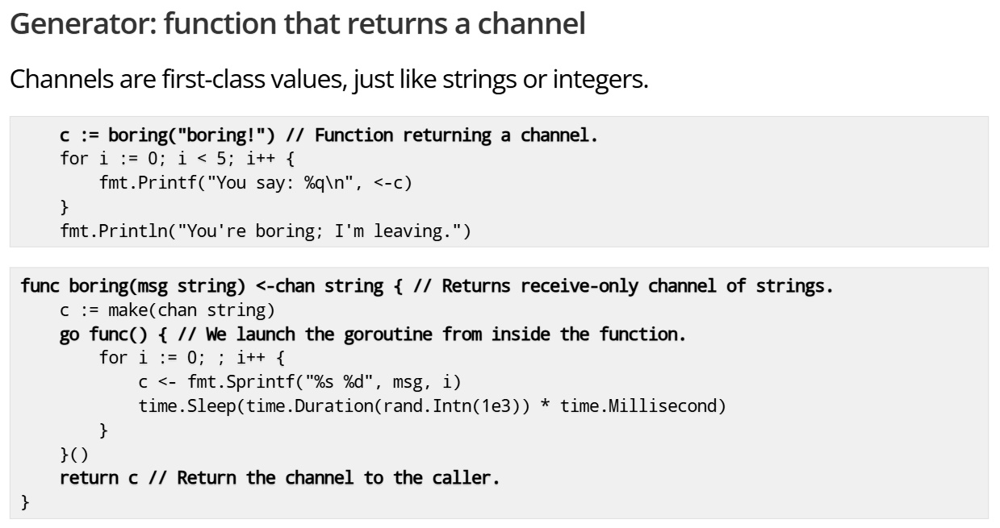

💡把generator想成一个完全黑盒的东西，他只是一个service，一个提供者，我们作为consumer，只需要去取数据就够了，他背后做了什么我们并不关注。
这样做，每个generator就像一个service，可以有多个实例，从多个实例的generator中拿数据。

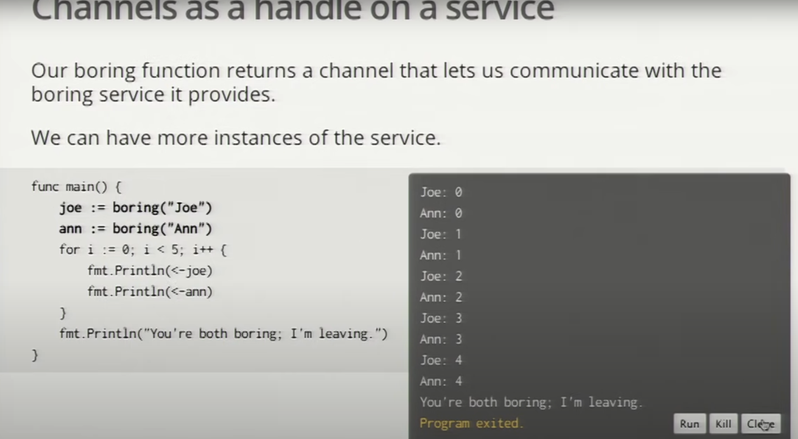

主程序的for循环如果channel里没有数据会阻塞，这样同时又可以严格控制执行流的顺序，太nice了。

那么如果我想让数据先到达的channel先输出怎么办呢？👇

#### multiplexing & fan-in function

“fan-in”函数用于将来自多个通道的数据汇聚到一个通道中。

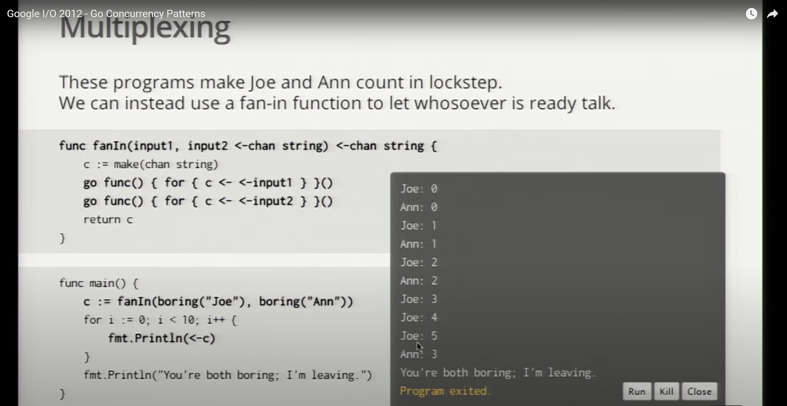

希望保持完全步调一致该怎么办？需要信号员介入，发消息时附带传呼机（在消息里夹带channel）用于发完消息后的通讯。
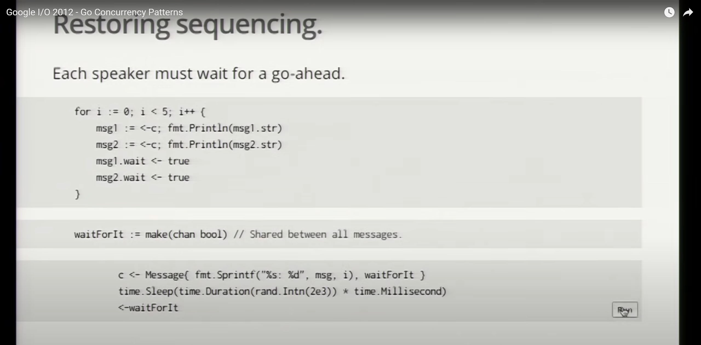

这是在上面fan-in函数的基础上修改而来。
其中Message是这样的struct。

```go
type Message struct{
	str string  // 要传递的信息
	wait chan bool  // 传呼机
}
```

每个人发完自己的消息后，需要等待信号员的信号，才能继续发送下一条消息。

而信号员要做的事，则是等待收到两个人的消息后，通过消息里夹带的传呼机，告诉两个人都说，ok你们可以继续了。

### select语句

💡核心，作为一个关键字加入go语言，而不是一种可选的包。
像switch一样选择某个非阻塞通道执行，一旦同一时刻有多个通道非阻塞可以选择，💣那么会随机执行一个。

`for { select {} }` 是一个无限循环，其中每次循环都会执行 `select` 语句。`select` 语句用于在多个通道操作上进行等待，直到其中一个操作可以继续执行。具体来说：

1. **进入循环**:
   - 程序进入 `for` 循环，开始新的一轮循环。
2. **执行 `select` 语句**:
   - `select` 语句检查所有 `case` 子句，看是否有可以立即执行的操作。
3. **等待可用操作**:
   - 如果没有任何 `case` 子句可以立即执行，`select` 语句会阻塞，直到至少有一个 `case` 子句可以执行。
4. **执行符合条件的 `case`**:
   - 一旦某个 `case` 子句的条件满足（例如从通道接收到数据或者定时器到期），该 `case` 子句的代码块就会执行。
   - 执行完该 `case` 子句的代码块后，`select` 语句结束，程序回到 `for` 循环的顶部，开始新一轮循环。

#### fan-in

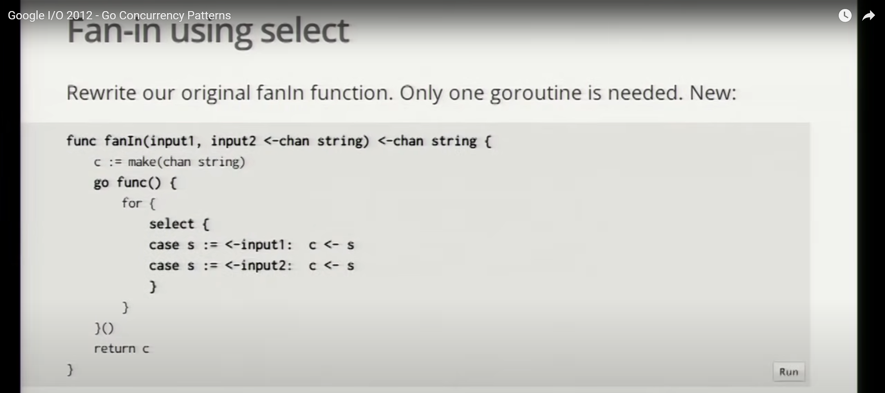
之前需要两个协程，像两个worker一样，从两个input管道分别拿数据（如果只有一个worker，那就是先从一个管道拿，再去另外一个管道拿，顺序是定死的交替的，会阻塞，所以必须是两个worker）。

但现在有了select以后，只需要一个worker就够，worker就可以选择性地拿数据了，而不强制要求有顺序，哪个管道的数据先到（非阻塞），就取数据。

#### 超时处理

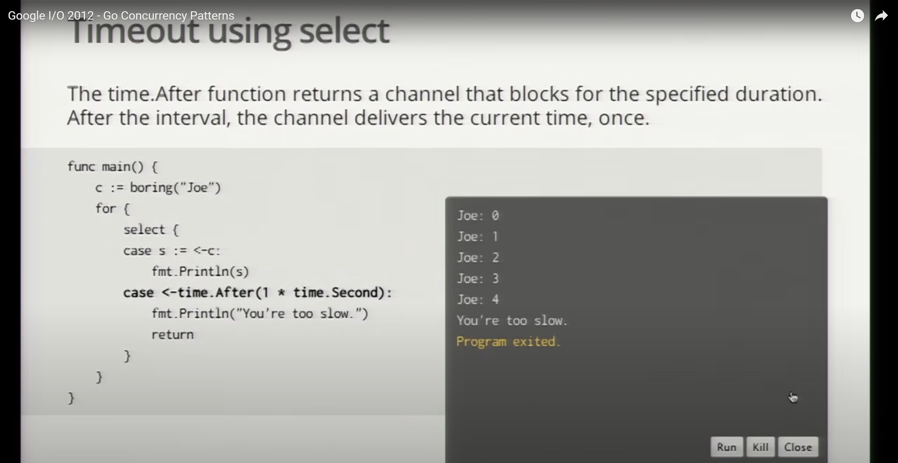
通过 `select` 语句和 `time.After` 函数，程序实现了一个简单的超时机制，用于处理通信延迟或阻塞的情况。
如果 `select` 语句在1秒内没有从 `c` 通道接收到消息，`time.After` 通道会在1秒后接收到一个值，从而触发超时处理。
这个例子相当于每条消息之间的间隔不能超过1秒，间隔超过1秒就算超时。

如果是整个会话最多持续5秒，那得在`for{ select{} }`外面写一个`timeout := time.After(5 * time.Second)`，然后在`select`里面`case <-timeout: return`。

#### 往返通信

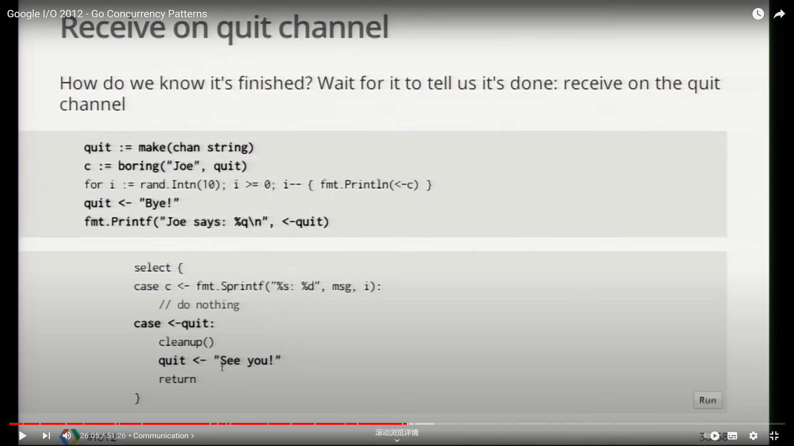
有点像握手协议的感觉，先通知对面我结束了，你可以清理了，然后清理完毕的那一方说，清理完毕了，你可以关门了。（往返通信）

### goroutine的轻量性

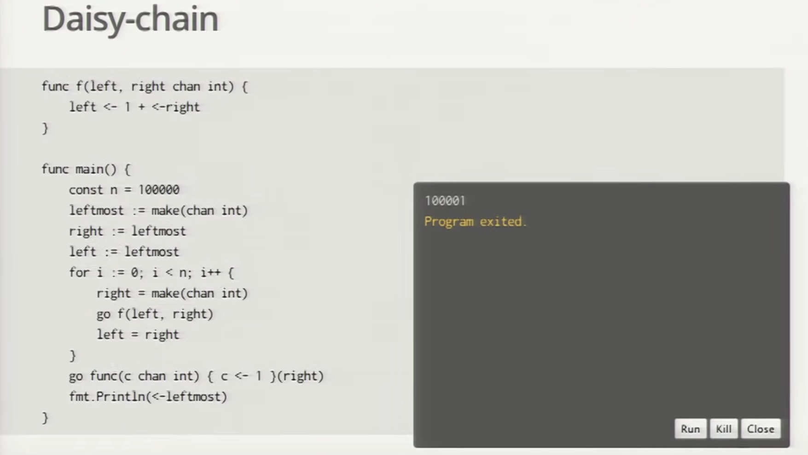
封面例子的代码，利用10万个gopher(即goroutine)去链式传递一个数字，每传递一次就加1，开了10万个goroutine，居然只花了零点几秒的时间，Amazing! 全场掌声雷动。

Go 语言的 goroutine 之所以轻量级，主要是由于以下几个原因：

- 每个goroutine的初始栈空间仅为2KB。相比之下，传统操作系统线程的初始栈空间通常是1MB。 且goroutine的栈是动态扩展的，可以按需增长和缩小。
- Go使用用户态调度器，由Go运行时管理goroutine的调度，而不是依赖于操作系统内核。这样减少了上下文切换的开销。
- goroutine利用操作系统线程，每个操作系统线程有个goroutine的队列。工作窃取算法负责负载均衡，如果当前线程队列为空，则去偷其他线程的任务。
- 创建一个goroutine比创建一个操作系统线程要轻量得多，因为不需要进行复杂的系统调用。
- goroutine的销毁也比线程更轻量，因为Go运行时会自动管理goroutine的生命周期和资源回收。

### 谷歌搜索案例

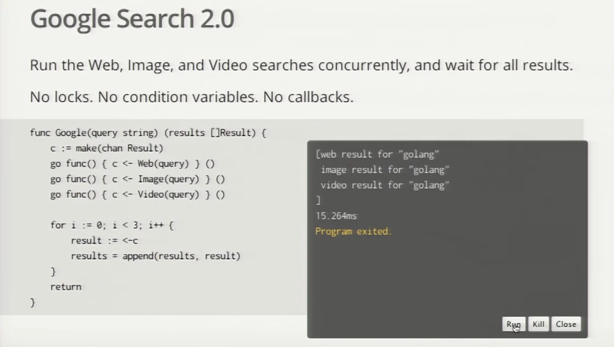

用fan-in的模式，实现了并发，实际是在等待查询最慢的那个，**没有用到任何锁**。

如果想要一个搜索服务稳定在80ms内返回，需要一个timeout，确实这个例子里80%的情况都能顺利完成，但是20%超时了怎么办？

💡多来几个同样的service，复制他们，然后取响应最快的那个service，就变成了找最慢响应里最快（min-max）的那个。这就大大提高了成功返回响应的概率。
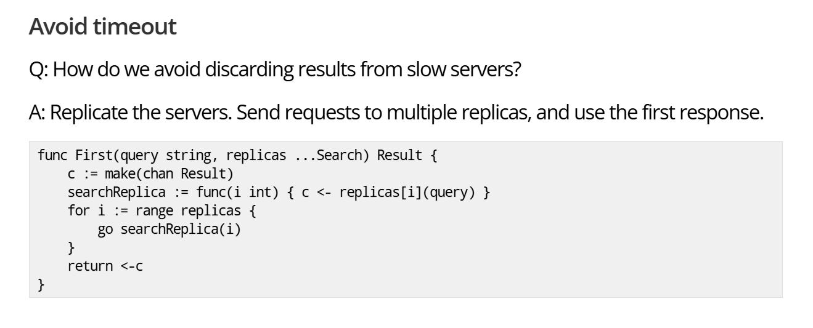

## 常见问题的solution

**goroutine泄露**

🤔比如一个goroutine，一直在for{}等待一个东西，但其实已经没东西可以等了，就应该关闭它。

**数据争用的检查**

脚本运行时添加-race参数。

出现各种bug是因为没用for{select{}}的模式，一定要用select去做判断！！！不要用if else。

**利用nil的channel**

从nil的channel取东西将永远被阻塞，如果放到select的case里面就是永远不会被执行， 初始化的时候不赋值（即声明为nil的channel），满足某个条件才把这个channel赋值，变成一个非nil的channel。

**用一个done channel去模拟async await**

比如去fetch一个东西，就把fetch这件事放到goroutine里去做，做完了给done channel一个信号，然后await的那个人收到done channel的信号后，就开始处理接下来的东西。

**闭包函数捕获循环变量❌**

如下面的例子：

```go
for i := 17; i <= 21; i++ { // write
    go func() { /* Create a new goroutine */
        apiVersion := fmt.Sprintf("v1.%d", i) // read
    }()
}
```

第二行中的匿名函数形成了一个闭包(closures)，在闭包内部可以访问定义在外面的变量，如上面的例子中，第 1 行在写 i 这个变量，在第 3 行在读 i 这个变量。这里的关键的问题是对同一个变量的读写是在两个 goroutine 里面同时进行的，因此是不安全的。

> Function literals are closures: they may refer to variables defined in a surrounding function. Those variables are then shared between the surrounding function and the function literal, and they survive as long as they are accessible.

可以修改成：

```go
for i := 17; i <= 21; i++ { // write
    go func(i int) { /* Create a new goroutine */
        apiVersion := fmt.Sprintf("v1.%d", i) // read
    }(i)
}
```

通过`passed by value`的方式规避了并发读写的问题。

## 结语💐

在 Go 的并发编程世界里，goroutine就像大海中的浪花🌊，自由奔涌却又彼此协调。
它们不需要争夺内存的疆域，而是通过轻盈的信使🕊——channel，彼此传递信息。
正如那句箴言所说："不要通过共享内存来通信，而是通过通信来共享内存"。
这种设计哲学赋予了并发编程一种诗意的美感，使每一次数据交换都宛如浪潮之间的轻柔碰触，和谐而高效。
在代码的广阔海洋中，让我们秉持这份浪漫与优雅，编写出既高效又优雅的程序。
