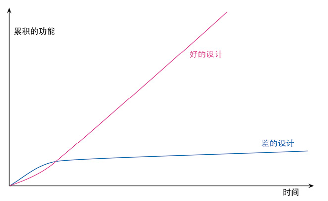

## 前言

刚上大学时，有幸接触了游戏行业的前辈，对我悉心指导，为我推荐了《游戏编程模式》(Game Programming Patterns)一书，从此开启了我对代码架构设计的思考。

我沉溺于设计模式，每次开始着手一个新项目时，总会在大脑里进行激烈的头脑风暴，这样的过程即愉悦又痛苦。痛苦在每次不经过个"三天三夜"的思考，我难以在键盘上敲下一个字符；
愉悦在架构设计完毕后，按设计模式书中的范式撰写代码的过程是那么流畅又优雅。在小型的项目上，这样的编码实践让我收获颇丰。
然而当我把这个习惯带到中大型项目时，头脑的内存容量不足以支撑我在初设计架构时，就把所有的一切都规划好。于是对于架构的思考变成了一种负担，令我难以下手编写代码，驻足不前，
待时间仓促之时，才不得已落下我的指尖，设计出令我勉强凑活满意的代码。

这样有过几次经历后，我只会反思是不是我还不够熟练，经验不够丰富，才导致设计决策这么犹豫呢。我将设计模式奉为圭臬，从来没对其有过质疑。直到前不久，看到
《Go语言设计与实现》的作者draveness写的一篇文章[《圣杯与银弹 · 没用的设计模式》](https://draveness.me/holy-grail-design-pattern/)，才打碎了我对设计模式的美好幻想。

> 学习设计模式与设计优秀的软件并不相关，盲目追求和套用书中的设计模式只能使项目变得更加糟糕。

文中对设计模式反思的几个核心观点:

- 抽象的设计模式是从不同具体项目中总结出来的通用经验，从具体到抽象的过程相对容易，然而从抽象的模式套用到具体场景却很困难，**如果没有足够的经验或者思考只会做出拙劣的设计**。
- 经验较少的工程师面对具体场景无从下手；经验丰富的工程师已经在实践中化为内功，不需要设计模式的指导。
- **If all you have is a hammer, everything looks like a nail!** 学了设计模式就去强行套用，只会是拙劣的模仿。
- 学习如何为程序编写单元测试对学习系统设计极其重要，提升项目单元测试覆盖率的过程会让我们思考如何写出更利于测试的代码，**虽然软件工程中没有银弹，但是单元测试不是银弹可能也所差无几了**。

这些观点直击我的软肋，没错因为我就是那个有了锤子🔨看啥都是钉子的人，生搬硬套导致我思考设计模式的过程异常痛苦。

虽然之前也接触过单元测试，但当时对单元测试的认知还只是停留在“嗯这是个测试，通过了说明测试的代码没有问题”。在又回顾了一遍单元测试框架，fixture和mock之类的概念，我还是一头雾水，对单元测试的理解浅显。
直到我又多看了几遍文章，翻到评论区，发现作者推荐《重构》这本书，书的名字一下抓住了我的心，我感觉到这就是我想要的东西，于是就吭哧吭哧地开啃，边学习边实践，对自己以前自以为是璞玉的代码，大刀阔斧地重构。
这才发现重构就算不是我心中的银弹，也是银钳子了，是**最细粒度的架构调整工具**。

而当单元测试遇上了重构，两者就像发生了化学反应一般美妙，相辅相成。 单元测试保证重构的过程，系统行为不发生变化。 重构使得单元测试的粒度更细，解构出更易于单元测试的代码。

## 故事的开端

你是一名新入职的工程师，Leader给你下达了在现有代码上新增feature的需求，你正准备撸起袖子大干一场，打开项目代码，迎面而来的是……

- 超长的代码段
- 不明所以的变量/函数命名
- 可变的变量在模块间传来传去
- 到处可见的重复代码
- 没有任何单元测试

你用广度优先的方法阅读你所要接触的模块，发现你不能一眼就从函数名上看出做了什么。
不得已，你用深度优先的方法看代码，可发现一个函数竟承担了好几个职责，你在上下文中游阅了好久，好不容易才看懂了代码，找到了你要修改的那部分，又发现面对的函数一眼不知有没有side effect，变量都是可变的无封装的，你不得不对那些变量和函数彻底调查一番，
进入新的函数，又臭又长的代码又接踵而至……

相信到这里，你已经清楚认识到了这是一坨屎山代码。什么，你说要用设计模式把代码重写？抱歉你的任务很紧急，并且抛开时间不谈，面对这样一坨代码，狗见了都摇头，谁能有信心一步到位重新用设计模式规整好呢？
这时候，重构的重要性不言而喻，作为最细粒度的代码架构规整手段，你可以毫无负担地去做修改，并且最终会**反直觉地加快你代码开发的速度**。

## 对重构和单元测试的误解

我在翻阅知乎对重构和单元测试的必要性时，多看到的是反对的声音，不外乎以下一些观点:

- 屎山怎么重构，根本没那个时间精力去维护，做新需求还来不及呢！
- 单元测试真的没必要，拖累开发进度，测的还都是掌控范围内的没意义，吃力不讨好。
- 单元测试就应该由专门的测试人员来写！让开发的写，一个人干两个人的活你倒是给我钱啊。
- ……

在我没看《重构》这本书之前，我可能会理解这些观点，一笑而过，认为上面发生的现象是再正常不过的事情。然而，书中早已对这些误解做出了预见性的回应，相信看了本书**第二章：重构的原则**后，一切答案不言自明。

### 重构 = 结构调整?

很多程序员，包括之前的我，都以为对代码进行结构性调整就代表“重构”。然而，本书作者对重构的定义非常严苛。

> 重构的关键在于运用大量微小且保持软件行为的步骤，一步步达成大规模的修改。每个单独的重构要么很小，要么由若干小步骤组合而成。
>
> 小步修改，以及它带来的频繁反馈，正是防止混乱的关键。
> 重构技术就是以微小的步伐修改程序。如果你犯下错误，很容易便可发现它。

书中面对各种情境下使用的重构手法不尽相同，但他们的共同之处都在于，每个步骤都保持了最小粒度的修改，保证代码的行为不改变，同时体现出了重构的过程。
小步伐反而跑得更快，因为一旦在重构过程中出现行为不一致的情况，就可以最细粒度恢复到行为一致时的代码，再重新思考开展重构。

### 集中时间做大刀阔斧的重构？

并不需要整个团队挑一个完整的时间段进行重构，而是集个人之力，把重构变成日常，在开发的过程中**顺便重构**。

- 在每次开发新feature的之前，发现对相关代码重构后更容易写新feature。
- 先理解代码，才能修改/新增/修复代码。理解时发现代码难懂，就进行重构，把理解融入代码中。

基本流程：先写单元测试，撰写代码使其能够通过单元测试，再对新代码进行重构。

> 重构对我当下的任务有帮助，而且让我未来的工作更轻松。这是一件很重要而又常被误解的事：重构不是与编程割裂的行为。
>
> 如果团队过去忽视了重构，那么常常会需要专门花一些时间来优化代码库，以便更容易添加新功能。在重构上花一个星期的时间，会在未来几个月里发挥价值。

### 一开始就做好架构设计？

屎山并不是一开始就臭的，而是代码在不断堆积的过程中慢慢变质腐臭。架构的好坏是随着开发的过程具有时间流动性的，并不是一开始设计优秀的架构就可以肆无忌惮，也并不是屎山代码就无药可救。
随着开发的进行，对软件的理解也会发生变化，之前好的设计也会变得不符合新的理解，这时候就需要对这些不符合新理解的片段进行重构。屎山代码也可以在你新增feature的时候对相关片段进行重构，
积小流以成江海。你**并不需要在开始设计代码的时候有太大负担**不敢下手，代码的架构是可以通过**每次一点点的经常性重构**变得更好的，一块顽石也能在逐渐打磨下变成美玉。

> 20 年前，行业的陈规认为：良好的设计必须在开始编程之前完成，因为一旦开始编写代码，设计就只会逐渐腐败。重构改变了这个图景。现在我们可以改善已有代码的设计，因此我们可以先做一个设计，然后不断改善它，哪怕程序本身的功能也在不断发生着变化。由于预先做出良好的设计非常困难，想要既体面又快速地开发功能，重构必不可少。

### 重构拖累开发进度？

恰恰相反，**重构使得软件更容易理解，帮助团队更快地开发**。如果不经常性对代码进行重构，那么对之前写下的代码的理解成本会越来越高，不光是对于你的团队成员，更有可能是几个月后的你。
在开发的过程中，理解代码占据了很大一部分时间，一段好理解的代码能让功能的修改变得轻松，反之则可能画上数倍的时间。并且，好理解的代码往往更容易写出少的bug，当bug发生时也更容易查清。


### 撰写单元测试拖累开发进度？

你可以反思一下自己在编写程序时的时间占比，是不是大概40%的时间在理解思考，20%的时间在撰写代码，剩下40%时间全都花在调试上，甚至更长呢？
相信所有程序员都经历过一个很细微的bug让你找个半天的经历。

单元测试的一部分意义在于，能够帮你省去调试的时间，是很**细粒度的自动化测试**。 只要编写单元测试的时间小于debug的时间，这都是非常赚的事情，更何况单元测试的收益不止于此，频繁运行的单元测试是**重构的基石**，帮助重构维持行为不变性，而重构又能提高开发进度。

另一方面来说，编写测试用例时，人脑就过了一遍逻辑；写相应的实现程序时，又过了一遍逻辑。得犯两次错才能骗过检测器，大大降低了出错的概率。

实际上，**单元测试反直觉地提高了开发速度**（部分是由重构带来的）。

### 重构后的代码性能下降？

在重构过程中，有些重构手法不可避免地会“损害性能”。然而，大部分情况，所谓的“损害性能”只不过是自己的臆想罢了，程序的性能热点通常集中在一小部分代码段中，
而对非性能热点部分的性能优化是在做无用功，因为根本不处于同一个时间复杂度量级上。

就算重构这段代码真的导致了性能问题，那也应该是性能优化阶段做的事，等到性能真的是个问题，被性能监控程序暴露出来的时候再去解决。更何况结构良好的代码粒度更细，更易于性能优化。

## 嗅着代码的臭味找到重构点

经验丰富的程序员往往嗅觉很灵敏，能够一鼻👃嗅出代码的臭味道，快准狠将其重构为美味的代码。而往往一开始写下代码时，臭味是难以体现的，
因为此时代码没涉及修改，后续没人要再看这段代码修改这段代码了，嗯……那臭就臭吧。

但是，这样不需要再修改的代码少之又少。往往是几个星期甚至几个月后，有人（也很有可能是自己）想要在这段代码上新增修改功能，修复bug时，发现无从下手。

- 没法直观看出这段代码的实现是为了什么意图（意图与实现间存在语义距离）
- 单个函数杂糅了多个职责，而修改功能只需要理解对应的单个职责，其余的那些增加了理解负担。（单一函数承担过多职责）
- 重复的代码片段。当修改一处时，得把重复片段都一起修改了，万一忘记了，就会造成数据不一致问题。
- 不经监控的可变数据。无处不在的可变数据却不经监控，很容易出现某个地方数据发生变化，调用者却不知的情况，造成数据不符合预期问题。
- ……

💡思考将来代码发生变化时，是否易于理解，易于修改。

作者针对这些坏味道，细分成了24种类型，方便代码的排查。下面是我对这些坏味道的理解与笔记。

### 1. 神秘命名（Mysterious Name）

**意图与实现间存在语句距离。**

修改程序的第一步，是理解程序。然而，很多时候思考不透彻的命名会对理解造成障碍甚至误导，没能够讲清楚这段代码实现手段代表的意图是什么，即存在语义距离。
书中有个很好的例子能够阐述意图与实现间的区别。

> 古老的计算机只有黑白屏显示器，如果你想高亮突显某些文本，就需要反转颜色的显示。为此，用于控制文本显示的类有一个叫作highlight的方法，其中的实现就只是调用reverse方法。

这里，highlight方法表明了这段代码的意图是高亮显示文本，然而其内部实现却是reverse方法。如果直接将reverse方法暴露在上下文中，
那么读者会一头雾水，不明白这段代码实现的意图是什么。将其包装成highlight函数则是大大拉近了实现与意图之间的语义距离。

因此，针对神秘命名常见的重构手段为`改变函数声明`，`变量改名`，`字段改名`。

### 2. 重复代码（Duplicated Code）

**遇到重复的代码，我们往往有原始本能，想要将其提炼在同一处。**

重复的代码片段往往意味着修改需要十分谨慎，一处修改，所有副本都要对应修改，不然会遭遇数据行为不一致问题。需要采用`提炼(Extract)函数/变量`手法。
如果代码相似却不同，还需要通过`移动语句`将相似部分放在一起提炼。

### 3. 过长函数（Long Function）

**函数越长，就越难理解。**

1. 函数太长，很大程度上说明了职责划分粒度不够细，让长函数划分成一个个命名良好的小函数，是这项重构的关键。通常需要`移动语句`将相关代码集中在一块，再进行`提炼`。

2. 同时长代码中充斥着各种临时变量，需要采用`以查询取代临时变量`（即原先以临时变量作为参数传入，改为调用函数查询的结果传入）。

3. 提炼后的函数可能会有许多参数，此时就需要`引入参数对象`（把经常一起出现的参数捆绑在一起变成对象）和`保持对象完整性`（就算只用到了对象的某几个属性，也传入整个对象），将过长的参数列表简化。

4. 这样之后如果函数还是有很多临时变量和参数，就需要杀手锏`以命令取代函数`（将函数改为对象，其临时变量和参数存储为对象的字段，原先的函数调用改为命令对象的执行）

5. 条件表达式如if/else和switch需要提炼，`分解条件表达式`（分支判断和执行均用小函数表达）。
   **重复的**switch和if/else要`以多态取代条件表达式`（将n个重复的条件分支转移到工厂函数中的1个条件分支创造不同的类，用多态性取代原先的条件分支）

6. 如果一个循环中承担多项任务，采用`拆分循环`（复制一个新循环，将单个任务从原循环中剥离，转移到新循环中），再进行`提炼`。

#### 移动语句

把相关的代码都移动挨在一起，更方便理解，也为了提炼函数做准备。提炼函数的作用是，相较于只是把相关代码凑到一处，把他们提炼出来集中成一个函数更方便理解。

#### 提炼

- 提炼函数的本质用意是，把**意图**和**实现**区分开来，把函数**用意图命名**，而不是用实现方式命名，意图和实现之间存在语义距离的时候，就需要进行提炼了。
- 当**函数的意图和实现非常接近时**，那其实没必要提炼出来，因为提炼就是为了更清晰，多了一层间接性没必要。
- 有时候一个计算的意图可以用临时的const变量存储，而不一定需要提炼成一个函数（因为提炼这个嵌套函数只会被当前函数所使用，不如用临时const变量代替函数，说明计算的意图）
- 决定是提炼成变量，还是提炼成函数的重要判断是：**是否仅在当前上下文中有意义**
  - 如果仅在当前上下文中有意义，提炼成变量；如果对整个类有意义，提炼成函数
  - 如果仅在当前上下文有意义，但是又太长了怎么办？提炼成嵌套函数，通过嵌套的方式，外层函数也能为内层函数提供一个上下文。（但如果能控制函数的可见性，那么就没必要做嵌套了）
  - 如果要提炼成嵌套函数，除非真的是一些很简单的函数，比如查询，计算之类的，不然还是不要嵌套了，不方便测试。**不要嵌套有副作用的函数！**

#### 以查询取代临时变量

我为了计算一个函数的参数，专门为他申明了一个临时变量去存储计算得到的结果，然后再传递给参数。这样不就多此一举吗，还增加了理解成本。
不如直接在函数参数传递的部分，就直接用查询去代替，而这个查询可以用函数封装起来。

🤔你可能会担心，用函数去返回简单的查询结果，会造成性能的下降

> 在聪明的编译器、现代的缓存技术面前，我们很多直觉都是不准确的。软件的性能通常只与代码的一小部分相关，改变其他的部分往往对总体性能贡献甚微。

💡不要关注琐碎的"变量复用"，性能的提升微不足道

#### 引入参数对象

如果几个参数通常成双成对地出现，那么可以将他们捆绑到一个对象中，甚至更多情况捆绑为一个类，从而将操作这些参数的行为通通迁移到该类中。

#### 保持对象完整性

通常引入参数对象后，就是保持对象完整性手法用到的时候，将整个参数对象作为整体传入。你可能会担心冗余性，即传入对象只用到了一些属性，
但是这里的冗余性也意味着可拓展性，如果需求变化了也无需改变客户端的接口调用。

如果担心的是对象的内容被修改，那么在设计的时候将该对象设计为值对象，把其setter去掉，并且getter返回深拷贝。

在设计的时候，就需要想清楚，如果这个对象是作为其他好多个对象的共享字段，修改能同步反应的，那么需要设计成引用对象；如果本身就希望这个对象，作为其他对象的字段，拥有不可变性，即修改不会反应到其他同类型对象上的字段中，那么就应该设计成值对象。
🤔但如果是引用对象，就代表全局只能拥有一个实例，需要有一个仓库（服务定位器设计模式）保存这个单一实例，去通过某个方法找到他。

#### 以命令取代函数

> 与普通的函数相比，命令对象提供了更大的控制灵活性和更强的表达能力。
>
> - 除了函数调用本身，命令对象还可以支持附加的操作，例如撤销操作。
> - 我可以通过命令对象提供的方法来设值命令的参数值，从而支持更丰富的生命周期管理能力。
> - 我可以借助继承和钩子对函数行为加以定制。
> - 如果我所使用的编程语言支持对象但不支持函数作为一等公民，通过命令对象就可以给函数提供大部分相当于一等公民的能力。
> - 同样，即便编程语言本身并不支持嵌套函数，我也可以借助命令对象的方法和字段把复杂的函数拆解开，而且在测试和调试过程中可以直接调用这些方法

#### 以多态取代条件表达式

比如最简单的状态机就是switch不同状态码，做不同的事。但稍微深入点的，就是每个状态都有Enter(), Update(), 和Quit()，通过超类的State委托不同的子类对象调用。

当代码中多处出现了以类型码为条件分支，进行逻辑判断时，就是多态性该应用的场景了。
把switch里各类型干的事情，挪到自己的类中，再把switch语句挪到工厂函数里，相当于用1个switch替代了n个switch。

💡最细粒度的做法，只要有多处出现了重复的条件分支（无论是单句if还是switch这种），都可以把条件分支做的事抛到子类中，变成一个variant，然后把条件分支转移到类型工厂函数中，替换掉原先的构造函数。

### 4. 过长参数列表（Long Parameter List）

参数列表过长，会导致调用端的难度加大，需要搞清楚每个参数的细节，并且充分理解上下文后才能传入正确的参数。

- 如果一个参数的值能通过另一个参数求得，那么使用`以查询代替参数`（将第二个参数改为通过查询函数传入）去掉。
- 如果几项参数同时出现，`引入参数对象`，如low和high表示上下界，则包装成range，在函数内部导出range.low和range.high
- 如果从原来的数据结构里抽出部分属性，那么`保持对象完整性`，直接传入整个参数
- 如果某个参数只用于控制函数内部的执行流，那么采用`移除标记参数`（去除控制流字面量，将控制流移到函数外部）
- 如果多个函数有共同的参数，那么用`函数组合成类`（将共同的参数作为类的字段），从函数式编程的角度来看，像柯里化后的部分应用函数。

#### 移除标记参数

最直观的例子是以一个bool变量作为参数，函数调用时直接传入字面量true / false作为参数。
当他人审视这段代码时，根本不清楚这里的true / false代表什么含义，不能一眼直观看出来。并且根据标记参数的不同，函数内部的控制流会发生变化，做不同的任务。
也是一个函数担任多个职责的范例。

💡当一个函数内的某个参数，只是为了控制执行流时，那么就应该把这个控制执行流的逻辑放在调用函数的地方，让这个函数本身只做一件事情，而不是根据标记参数，去选择执行哪个分支。

> 如何判断参数是否为标记参数？
>
> - 如果调用者传入的是程序中流动的数据，这样的参数不算标记参数；
> - 只有调用者直接传入字面量值，这才是标记参数。
> - 在函数实现内部，如果参数值只是作为数据传给其他函数，这就不是标记参数；
> - 只有参数值影响了函数内部的控制流，这才是标记参数。

一句话总结：参数是字面量值，并且在函数内部用于控制流，即为标记参数。

### 5. 全局数据（Global Data）

全局数据的噩梦在于无法监控对数据的修改，任何一处隐藏在角落的意外修改可能都会导致其他引用全局数据的地方出现故障。同样，类变量和单例模式也存在这样的问题。
在学设计模式的时候，就提到过学习单例模式是为了避免使用单例模式，而服务定位器模式是其良好的替代品。

解决这类可变数据的核心思路在于监控，通过`封装变量`（getter和setter）的方法控制其访问与修改。

### 6. 可变数据（Mutable Data）

数据的可变性是bug的万恶之源，在某处的修改，可能会招致不符合预期的意外发生。函数式编程的核心在于**数据永不改变**。

- 在刚开始设计一个变量时，就应该考虑其是否应该是const的，const数据可以随意使用，不用担心被修改，随意复制都没事。
- 如果数据不得已是可变的
  - 必须有手段能够监控其修改与访问，`封装变量`是常用手段。
  - 修改尽量集中方便调查，用`函数组合成类`和`函数组合成变换`（将多处函数修改集中到一个transform函数中）
  - 如果一个变量在不同时刻担任不同责任，那么也需要`拆分变量`（将单变量拆分为多个单职责的变量）。
- `将查询函数和修改函数分离`，确保查询操作中不存在更新行为，不会有副作用，只在修改函数中更新状态，隔离可变行为。
- 由核心数据计算出来的派生数据，必须随着核心数据的修改而修改，保持数据一致性。然而，更好的办法是采用`以查询取代派生变量`（不对派生变量存储，只在需要时通过核心数据即时查询计算）。
- 对象引用本身的修改容易通过getter和setter监控，但对象内容的修改不易监控。因此尽量`将引用对象改为值对象`（值对象保持内容不变性），替换整个数据结构作为修改。

💡能const尽量const，不能const就得监控起来，同时修改尽量集中于一处，方便调查。

#### 封装变量

> 封装能提供一个清晰的观测点，可以由此监控数据的变化和使用情况，还可以轻松地添加数据被修改时的验证或后续逻辑。

setter监控对象引用本身的修改，getter监控对象引用本身的访问。💣封装变量无法做到对象内容的监控。

```js
let defaultOwnerData = { firstName: 'Martin', lastName: 'Fowler' }
export function defaultOwner() {
	return defaultOwnerData
}

// 外部模块
defaultOwner().firstName = 'Mark' // 成功修改内容
```

~~export function setDefaultOwner(arg) {
defaultOwnerData = arg;
}~~

这里**去除setter仅仅代表，该对象引用不能够被重新赋值**，但这个对象内容还是能修改的。

要禁止对对象内容的修改，有两种角度。

1. 取值函数返回整个对象的**深拷贝**

```js
export function defaultOwner() {
	return Object.assign({}, defaultOwnerData)
}
```

这样通过getter得到的是完全独立的一份复制品，随意修改都对原对象不会造成影响。然而深拷贝有时候会导致性能问题，但还是一样的原则，
等这部分代码真的成为性能热点的时候再去优化。

2. 禁止对对象内容的修改

```js
let defaultOwnerData = new Person({ firstName: 'Martin', lastName: 'Fowler' })
export function defaultOwner() {
	return defaultOwnerData
}
export function setDefaultOwner(arg) {
	defaultOwnerData = arg
}

class Person {
	constructor(data) {
		this._lastName = data.lastName
		this._firstName = data.firstName
	}

	get lastName() {
		return this._lastName
	}

	get firstName() {
		return this._firstName
	}
}
```

将对象内部的顶层字段改为值对象（即对象的顶层字段均为const对象），限制对对象顶层内容的修改。

- 然而上面的例子还是不能阻止defaultOwnerData.\_lastName= 'abc'，js动态语言没法阻止访问，需要将字段\_lastName设为private，再不开放public的setter才可以。
- 最简单的方法，Object.freeze()，能够冻结顶层对象，使得顶层对象不被修改，但要使整个对象内容不能修改，得递归冻结。
- 对顶层字段使用const也像Object.freeze()，即不能修改对象的顶层字段，但是对象顶层字段的嵌套内容还是能修改的。

#### 拆分变量

🤔当同一个变量被再次赋值时，就需要思考第二次赋值，和第一次赋值，他们承担的责任是一样的吗？如果是循环变量或者收集结果（a+=x）这种变量，
那没问题，但如果是其他的，就需要重新声明一个新的变量，并且尽量声明为const。

#### 将查询函数和修改函数分离

💣如果不将修改函数和查询函数分离开来，那么你要看一个函数是否有副作用，就能把整个完整的调用栈调查一遍，才能确认有没有副作用。

🤔而如果把查询函数（无副作用）和修改函数（有副作用）一开始就分离开来，那么就无需担心这个问题，**查询函数里只允许调用另外的查询，不允许有看得见的修改。** 修改函数里调用查询函数是没事的。

> 明确表现出“有副作用”与“无副作用”两种函数之间的差异，是个很好的想法。下面是一条好规则：**任何有返回值的函数，都不应该有<看得到的>副作用**——命令与查询分离。
>
> 如果遇到一个“既有返回值又有副作用”的函数，我就会试着将查询动作从修改动作中分离出来。

有些查询函数也可能有一些看不到的副作用：这里指的是把查询的结果缓存到某个字段中，这个缓存的过程就是一种副作用，但是对于查询函数本身来说是看不到的副作用，因为每次查询都会返回不变的结果。

C++ const函数此时的威力就显现出来了，不需要自己太有负担去递归调查有返回值的函数是否有副作用。不过，const函数不代表没有side effect。
对于引用类型的成员变量，const成员函数不能改变它们的引用（即不能让它们指向其他对象），但可以通过引用修改它们所指向对象的内容。
const函数同样只是冻结了顶层成员变量而已。

#### 以查询取代派生变量

> 使用类的一大好处是：客户端可以修改对象的核心数据，通过计算得出的派生数据会自动与核心数据保持一致。

🤔这句话的含义是什么呢？

💡首先最简单直白的诠释是如下的例子：**每次获取派生数据时，均由核心数据即时计算而来，而不是通过存储派生数据的方式**。避免了“源数据修改时忘了更新派生变量”的错误。

```python
class Rectangle:
    def __init__(self, width, height):
        self.width = width
        self.height = height

    @property
    def area(self):
        return self.width * self.height

    @property
    def perimeter(self):
        return 2 * (self.width + self.height)

# 创建一个Rectangle对象
rect = Rectangle(3, 4)

# 访问派生数据
print(f"Area: {rect.area}")         # 输出: Area: 12
print(f"Perimeter: {rect.perimeter}") # 输出: Perimeter: 14

# 修改核心数据
rect.width = 5
rect.height = 6

# 访问派生数据，自动更新
print(f"Area: {rect.area}")         # 输出: Area: 30
print(f"Perimeter: {rect.perimeter}") # 输出: Perimeter: 22

```

每次获取派生数据时，都根据核心数据去即时计算，这样派生数据一定会保持与核心数据一致。
⭐即时计算派生数据的正确性肯定比存储派生数据要好，因为派生数据没准在哪就被修改过了。

派生数据由核心数据计算而来，核心数据修改时，派生数据会随之修改。💣因此，大部分人的直观想法是，在setter中修改核心数据的同时，更新派生数据。

```python
class Rectangle:
    def __init__(self, width, height):
        self._width = width
        self._height = height
        self._area = width * height
        self._perimeter = 2 * (width + height)

	@width.setter
	def width(self, new_width):
		self._width = new_width
		self._update_derived_data()

	@height.setter
	def height(self, new_height):
		self._height = new_height
		self._update_derived_data()

	def _update_derived_data(self):
		self._area = self.width * self.height
		self._perimeter = 2 * (self.width + self.height)

	# width, height, area, perimeter的getter都省略了
```

这样做的好处是把派生数据存储起来了，性能上不用每次即时重复计算，但坏处是要在核心数据的setter中维护这些派生数据, 有时核心数据修改时忘了更新派生变量。

💡有一种情况不得不使用这种做法，即修改核心数据时，带动了一些派生(捆绑)行为的调用

```python
@some_varible.setter
def some_varible(self, new_some_varible):
	self._some_varible = new_some_varible
	self.foo()
```

这里的setter相当于观察者模式中，同时扮演了发布者和订阅者两个身份，即核心数据变更时，直接对订阅者的行为进行调用，完全耦合在一起（简单的场景下没问题，但复杂场景还是用观察者模式）

```python
@some_varible.setter
def some_varible(self, new_some_varible):
	self._some_varible = new_some_varible
	self._publisher.notify(self)
```

### 7. 发散式变化（Divergent Change）

也即**上下文边界不清晰，多种上下文混淆成一个上下文**。一旦需要修改，我们希望只需要集中在系统的某一点，理解其上下文即可。

拿书中的例子，比如某个模块一共有7个函数，新加入一个数据库只需要动其中3个函数，新出现一种金融工具动另外的4个函数，那就是上下文边界不够清晰。
两类上下文现在充斥在同一个上下文中，导致了额外的理解成本。

- 如果不同的上下文有处理的先后顺序，就采用`拆分阶段`（每个阶段的输出作为下个阶段的输入）对模块进行拆分，
- 如果不同上下文之间需要互相传递消息，那么就`搬迁函数`把各自的逻辑搬到自己的模块内。

### 8. 霰弹式修改（Shotgun Surgery）

一旦需要修改，发现必须搜寻四散开来的变化，做出对应的变化，那么就是霰弹式修改。

💡把四散的代码聚集到一处

- 使用`搬迁函数`和`搬迁字段`
- 如果有很多函数都在操作相似的数据结构，可以使用`函数组合成类`和`函数组合成变换`
- 如果代码杂乱，可以先采用`内联函数`手法先将小函数内联回去，再将相关代码凑到一处，整理成新的小函数，再将多个小函数进行组合

### 9. 依恋情结（Feature Envy）

检查类中函数与其他模块的交流情况，如果发现它与其他模块交流胜于模块内部的交流（如从其他模块取大量数据或调用），这便是依恋情节。

💣误解：模块内的函数，被其他模块调用的次数，胜于模块内调用的次数，这并不能说明有依恋。我们**要考察的是该函数主动使用其他模块的情况，而不是被使用的情况**。

- `搬迁函数`，将有依恋的那个函数迁移到另一个模块，如果该函数中只有部分代码片段有依恋，那么就先`提炼`，再搬迁。
- 一个函数使用多个模块的功能？哪个模块拥有的此函数使用的数据最多，就把这个函数和那些数据摆在一起。

### 10. 数据泥团（Data Clumps）

如果发现几项数据成群结队地出现，那么就形成了数据泥团。

- 如果是两个类中存在相同的字段，那么`提炼类`，将相同的字段和操作这些字段的函数放到新的类中。
- 如果是函数签名中存在相同的参数，那么`引入参数对象`后再`保持对象完整`，简化函数调用。

> 一个好的评判办法是：删掉众多数据中的一项。如果这么做，其他数据有没有因而失去意义？如果它们不再有意义，这就是一个明确信号：你应该为它们产生一个新对象/类。

### 11. 基本类型偏执（Primitive Obsession）

基本类型没法提供对数据的定制操作，导致代码中对同一个领域的数据操作重复。比如判断一个数是否在一个区间，用基本类型就得是 low <= x <= high，但这些操作都可以提炼到类中，
变成x.inRange(low,high)。

- `以对象取代基本类型`，将操作的基本类型封装成类对象，将同一个领域对数据的重复操作提炼为类的函数。
- 如果要替换的是控制条件行为的类型码，则可以运用`以子类取代类型码`再加上`以多态取代条件表达式`的组合处理。

### 12. 重复的 switch （Repeated Switches）

重复的条件分支（if/else和switch）导致霰弹式变化，修改一处，就必须同时对另外几处进行相同的修改。

- `以多态取代条件表达式`，将多个重复的条件分支转化为工厂函数中的单个条件分支，以去除重复性，原先条件分支处，改用多态性处理。

### 13. 循环语句（Loops）

相比循环是由好几行代码构成，需要理解的成本更高；集合管道能清晰的知道对什么数据操作，输入是什么，输出是什么；并且能够对数据进行一道一道的加工处理。

```js
// 输入数组
const numbers = [1, 2, 3, 4, 5, 6, 7, 8, 9, 10]

// 使用管道操作进行链式处理
const result = numbers
	.filter((num) => num % 2 === 0) // 过滤出偶数
	.map((num) => num ** 2) // 将偶数平方
	.reduce((acc, num) => acc + num, 0) // 求和
```

### 14. 冗赘的元素（Lazy Element）

对一片代码的重构进行到后期时，会发现有些结构没必要加一层额外的间接性，加重理解成本。

- 当小函数的命名与实现几乎一模一样时，直接`内联函数`去掉这层额外的函数调用。
- 如果一个类只由一个简单的函数构成，直接`内联类`，将其还原到调用处。

### 15. 夸夸其谈通用性（Speculative Generality）

刚开始设计代码架构时，总会想着其可拓展性要高，方便后续代码的撰写和维护。然而架构设计也是过犹不及，
过度的架构设计，比如各种委托调用，提前预留的接口和参数等，往往会加重开发人员的理解和维护负担。
但还是那个原则，等到**真的有必要有需求的时候再去设计**，而不是光凭臆想就提前过度设计。重构使得代码架构的维护变得简单，
不必担心在代码大厦建立起来之后就难以施工修改，

- 使用`内联`手法去掉不必要的委托。
- `折叠继承体系`去掉没必要的抽象基类。
- `改变函数声明`去除暂且用不上的函数参数。

### 16. 临时字段（Temporary Field）

有时能观察到类内某个字段只是为了某种特殊情况而设置的，并不具有在类内上下文具有通用性，会让理解代码的人一头雾水。

- `提炼类`将相关临时字段和操作这些字段的函数搬迁到新的类中。
- 如果是为了处理空值而做各种重复的条件判断，设置临时字段，那么`引入Null对象`

#### 引入Null对象

Null对象和正常对象看起来一模一样，只不过行为调用时do nothing，返回特殊值，避免了显式的null检查。在构造对象时，根据相关字段的属性，返回正常对象/空对象。
💡本质上是将重复的特殊情况判断，转移到了对象创建时。

### 17. 过长的消息链（Message Chains）

大型项目中可能会常常看到很长委托调用链，x = a.b.c.d，一旦委托链上的任意一处进行了改动，
所有相同委托链处都需要进行相应的修改，造成了霰弹式变化。即客户端代码与查找过程中的导航结构紧密耦合。

- 采用`隐藏委托关系`的手法，即将委托链用函数封装起来，看起来是x = a.d直接访问，实际上内部还是原先的委托链，只不过发生变动时，只需要集中一处对封装委托链的函数修改即可。

### 18. 中间人（Middle Man）

代码设计时往往会出现过度运用委托的现象，造成不必要的消息传递和理解成本。

- 当类中过半的函数都通过委托给其他类对象处理，那么直接与那个类对象打交道即可，`移除中间人`。

### 19. 内幕交易（Insider Trading）

如果两个模块频繁交换数据，那么就是耦合程度比较高了。同样的原则，尽量减少模块间的交互，如果不得已，那么需要集中监控交流。

- 通过`搬迁`手法，将有依恋情结的函数和字段从模块内搬迁到另一个模块中。
- 如果有不可避免的交互，需要集中监控。新建一个模块作为交流数据的中转地。

### 20. 过大的类（Large Class）

一个类如果做了太多事情，那么往往承担了多个责任，需要提炼类进行细分。

- 通过发散式变化区分类内不同的上下文，将同一个上下文的字段和函数`提炼`，变成类内的组件。
- 通过观察类的使用者，找到拆分类的线索。如果使用者只用了所有功能的子集，往往这个子集可以提炼成新的类。

### 21. 异曲同工的类（Alternative Classes with Different Interfaces）

相似的类却拥有不同的接口，需要将其接口调整为一致，才能使得相似的类具有可替换性。

- 通过`搬迁函数`和`改变函数声明`将两者的协议统一，如果有重复片段，`提炼超类`。

### 22. 纯数据类（Data Class）

一个类如果只有数据，没有操作这些数据的行为，那么说明行为错误四散在其使用者之间，
需要通过`搬迁`手法将四散的行为迁移到原先的纯数据类中，使其成为一个功能完整的类。

### 23. 被拒绝的遗赠（Refused Bequest）

如果一个子类继承了超类，却不要想超类的一些字段和行为，那么说明继承体系设计错误了。

- 如果认为超类设计无误，而子类却只想要其部分功能，那么其实不该做继承，而是采用委托，可以是`以委托取代超类`，也可以是反过来`以委托取代子类`。
- 如果认为超类设计有误，那么将超类中不想用到的函数和字段`搬迁`到子类的兄弟类中。

### 24. 注释（Comments）

如果需要一段注释来解释代码做了什么，那往往说明这块代码不够直观清晰，还需要`提炼`，
如果提炼后还是需要注释，说明函数的名字未能充分表达其意图，需要改名，弥补意图与实现之间的语义距离。
如果需要注释来假设上下文环境，那么`引入断言`保证上下文环境是符合预期的。
当重构完成之后，往往发现注释已经是多余的了，因为理解已经全部融入代码了。

## 结语💐

作为一名尚未踏入职场的学生，能够在职业生涯的起步阶段邂逅《重构》这本书，实属莫大的幸运。尽管在初次实践中，许多地方的理解依旧显得浅显，但已然给予我无尽的启迪和深厚的收获。
一部经典之作的价值，便在于每一次翻阅，都能带来全新的感悟与思考。

愿《重构》的智慧之光，能在我漫长的职业旅途中，始终照耀着前行的道路，助我踏上更遥远的征途，追寻那无垠的天际与璀璨的星辰✨。
